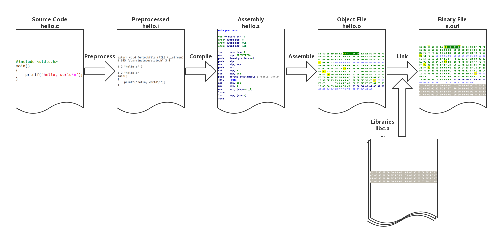

# C 语言基础

- [从源代码到可执行文件](#compile)

## <span id="compile">从源代码到可执行文件</span>
我们以经典著作《The C Programming Language》中的第一个程序 “Hello World” 为例，讲解 Linux 下 GCC 的编译过程。

```c
#include <stdio.h>
main()
{
    printf("hello, world\n");
}
```

```text
$gcc hello.c
$./a.out
hello world
```

以上过程可分为4个步骤：预处理（Preprocessing）、编译（Compilation）、汇编（Assembly）和链接（Linking）。



### 预编译
```text
$gcc -E hello.c -o hello.i
```

预编译过程主要处理源代码中以 “#” 开始的预编译指令：
- 将所有的 “#define” 删除，并且展开所有的宏定义。
- 处理所有条件预编译指令，如 “#if”、“#ifdef”、“#elif”、“#else”、“#endif”。
- 处理 “#include” 预编译指令，将被包含的文件插入到该预编译指令的位置。注意，该过程递归执行。
- 删除所有注释。
- 添加行号和文件名标号。
- 保留所有的 #pragma 编译器指令。

### 编译
```text
$gcc -S hello.c -o hello.s
```
编译过程就是把预处理完的文件进行一系列词法分析、语法分析、语义分析及优化后生成相应的汇编代码文件。

### 汇编
```text
$gcc -c hello.s -o hello.o
或者
$gcc -c hello.c -o hello.o
```
汇编器将汇编代码转变成机器可以执行的指令。

### 链接
目标文件需要链接一大堆文件才能得到最终的可执行文件。链接过程主要包括地址和空间分配（Address and Storage Allocation）、符号决议（Symbol Resolution）和重定向（Relocation）等。
