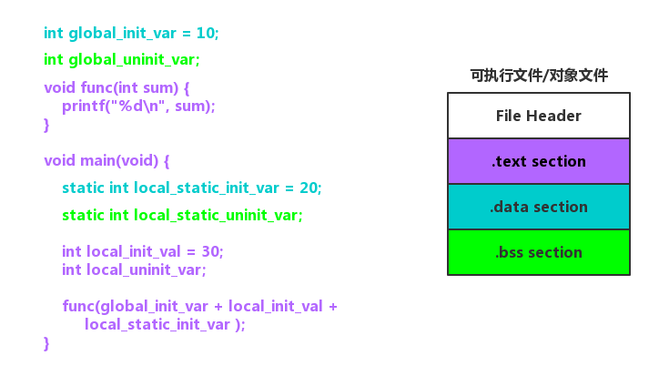
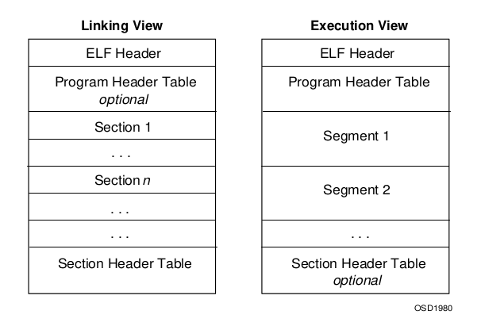

# 1.5.3 Linux ELF

- [一个实例](#一个实例)
  - [elfdemo.o](#elfdemoo)
- [ELF 文件结构](#elf-文件结构)


## 一个实例
在 *1.5.1节 C语言基础* 中我们看到了从源代码到可执行文件的全过程，现在我们来看一个更复杂的例子。
```c
#include<stdio.h>

int global_init_var = 10;
int global_uninit_var;

void func(int sum) {
    printf("%d\n", sum);
}

void main(void) {
    static int local_static_init_var = 20;
    static int local_static_uninit_var;

    int local_init_val = 30;
    int local_uninit_var;

    func(global_init_var + local_init_val +
         local_static_init_var );
}
```

然后分别执行下列命令生成两个文件：
```text
$ gcc -c elfDemo.c -o elfDemo.o

$ gcc elfDemo.c -o elfDemo
```
使用 ldd 命令打印所依赖的共享库：
```text
$ ldd elfDemo
	linux-gate.so.1 (0xf76e3000)
	libc.so.6 => /usr/lib32/libc.so.6 (0xf74e5000)
	/lib/ld-linux.so.2 (0xf76e5000)
```

使用 file 命令查看相应的文件格式：
```text
$ file elfDemo.o
elfDemo.o: ELF 32-bit LSB relocatable, Intel 80386, version 1 (SYSV), not stripped
$ file elfDemo
elfDemo: ELF 32-bit LSB executable, Intel 80386, version 1 (SYSV), dynamically linked, interpreter /lib/ld-linux.so.2, for GNU/Linux 2.6.32, BuildID[sha1]=355f04de44bc77b1d0b98f98e80282f8daad2340, not stripped
$ file -L /usr/lib32/libc.so.6
/usr/lib32/libc.so.6: ELF 32-bit LSB shared object, Intel 80386, version 1 (GNU/Linux), dynamically linked, interpreter /usr/lib32/ld-linux.so.2, BuildID[sha1]=449cba91635c01f9cbc303b1c962b38aff6a4431, for GNU/Linux 2.6.32, not stripped
```

于是我们得到了 Linux 可执行文件格式 ELF （Executable Linkable Format）文件的三种类型：
- 可重定位文件（Relocatable file）
  - 包含了代码和数据，可以和其他目标文件链接生成一个可执行文件或共享目标文件。
  - elfDemo.o
- 可执行文件（Executable File）
  - 包含了可以直接执行的文件。
  - elfDemo
- 共享目标文件（Shared Object File）
  - 包含了用于链接的代码和数据，分两种情况。一种是链接器将其与其他的可重定位文件和共享目标文件链接起来，生产新的目标文件。另一种是动态链接器将多个共享目标文件与可执行文件结合，作为进程映像的一部分。
  - libc-2.25.so


此时他们的结构如图：



可以看到，在这个简化的 ELF 文件中，开头是一个“文件头”，之后分别是代码段、数据段和.bss段。程序源代码编译后，执行语句变成机器指令，保存在`.text`段；已初始化的全局变量和局部静态变量都保存在`.data`段；未初始化的全局变量和局部静态变量则放在`.bss`段。

把程序指令和程序数据分开存放有许多好处，从安全的角度讲，当程序被加载后，数据和指令分别被映射到两个虚拟区域。由于数据区域对于进程来说是可读写的，而指令区域对于进程来说是只读的，所以这两个虚存区域的权限可以被分别设置成可读写和只读，可以防止程序的指令被改写和利用。

### elfDemo.o
接下来，我们更深入地探索目标文件，使用 objdump 来查看目标文件的内部结构:
```text
[firmy@manjaro elfDemo.c_dir]$ objdump -h elfDemo.o

elfDemo.o:     file format elf32-i386

Sections:
Idx Name          Size      VMA       LMA       File off  Algn
  0 .text         0000005b  00000000  00000000  00000034  2**0
                  CONTENTS, ALLOC, LOAD, RELOC, READONLY, CODE
  1 .data         00000008  00000000  00000000  00000090  2**2
                  CONTENTS, ALLOC, LOAD, DATA
  2 .bss          00000004  00000000  00000000  00000098  2**2
                  ALLOC
  3 .rodata       00000004  00000000  00000000  00000098  2**0
                  CONTENTS, ALLOC, LOAD, READONLY, DATA
  4 .comment      0000001b  00000000  00000000  0000009c  2**0
                  CONTENTS, READONLY
  5 .note.GNU-stack 00000000  00000000  00000000  000000b7  2**0
                  CONTENTS, READONLY
  6 .eh_frame     00000064  00000000  00000000  000000b8  2**2
                  CONTENTS, ALLOC, LOAD, RELOC, READONLY, DATA
```
可以看到目标文件中除了最基本的代码段、数据段和BSS段以外，还有一些别的段。注意到 .bss 段没有 `CONTENTS` 属性，表示它实际上并不存在，.bss 段只是为为未初始化的全局变量和局部静态变量预留了位置而已。

#### 代码段
```text
$ objdump -x -s -d elfDemo.o
......
Sections:
Idx Name          Size      VMA       LMA       File off  Algn
  0 .text         0000005b  00000000  00000000  00000034  2**0
                  CONTENTS, ALLOC, LOAD, RELOC, READONLY, CODE
......

Contents of section .text:
 0000 5589e583 ec0883ec 08ff7508 68000000  U.........u.h...
 0010 00e8fcff ffff83c4 1090c9c3 8d4c2404  .............L$.
 0020 83e4f0ff 71fc5589 e55183ec 14c745f4  ....q.U..Q....E.
 0030 1e000000 8b150000 0000a104 00000001  ................
 0040 c28b45f4 01d083ec 0c50e8fc ffffff83  ..E......P......
 0050 c410908b 4dfcc98d 61fcc3             ....M...a..     
......

Disassembly of section .text:

00000000 <func>:
   0:	55                   	push   %ebp
   1:	89 e5                	mov    %esp,%ebp
   3:	83 ec 08             	sub    $0x8,%esp
   6:	83 ec 08             	sub    $0x8,%esp
   9:	ff 75 08             	pushl  0x8(%ebp)
   c:	68 00 00 00 00       	push   $0x0
  11:	e8 fc ff ff ff       	call   12 <func+0x12>
  16:	83 c4 10             	add    $0x10,%esp
  19:	90                   	nop
  1a:	c9                   	leave  
  1b:	c3                   	ret    

0000001c <main>:
  1c:	8d 4c 24 04          	lea    0x4(%esp),%ecx
  20:	83 e4 f0             	and    $0xfffffff0,%esp
  23:	ff 71 fc             	pushl  -0x4(%ecx)
  26:	55                   	push   %ebp
  27:	89 e5                	mov    %esp,%ebp
  29:	51                   	push   %ecx
  2a:	83 ec 14             	sub    $0x14,%esp
  2d:	c7 45 f4 1e 00 00 00 	movl   $0x1e,-0xc(%ebp)
  34:	8b 15 00 00 00 00    	mov    0x0,%edx
  3a:	a1 04 00 00 00       	mov    0x4,%eax
  3f:	01 c2                	add    %eax,%edx
  41:	8b 45 f4             	mov    -0xc(%ebp),%eax
  44:	01 d0                	add    %edx,%eax
  46:	83 ec 0c             	sub    $0xc,%esp
  49:	50                   	push   %eax
  4a:	e8 fc ff ff ff       	call   4b <main+0x2f>
  4f:	83 c4 10             	add    $0x10,%esp
  52:	90                   	nop
  53:	8b 4d fc             	mov    -0x4(%ebp),%ecx
  56:	c9                   	leave  
  57:	8d 61 fc             	lea    -0x4(%ecx),%esp
  5a:	c3                   	ret    
```
`Contents of section .text` 是 `.text` 的数据的十六进制形式，总共 0x5b 个字节，最左边一列是偏移量，中间4列是内容，最右边一列是 ASCII 码形式。下面的 `Disassembly of section .text` 是反汇编结果。

#### 数据段和只读数据段
```text
......
Sections:
Idx Name          Size      VMA       LMA       File off  Algn
  1 .data         00000008  00000000  00000000  00000090  2**2
                  CONTENTS, ALLOC, LOAD, DATA
  3 .rodata       00000004  00000000  00000000  00000098  2**0
                  CONTENTS, ALLOC, LOAD, READONLY, DATA
......
Contents of section .data:
 0000 0a000000 14000000                    ........        
Contents of section .rodata:
 0000 25640a00                             %d..            
.......
```
`.data` 段保存已经初始化了的全局变量和局部静态变量。`elfDemo.c` 中共有两个这样的变量，`global_init_var` 和 `local_static_init_var`，每个变量4个字节，一共8个字节。由于小端序的原因，`0a000000` 表示 `global_init_var` 值（`10`）的十六进制 `0x0a`，`14000000` 表示 `local_static_init_var` 值（`20`）的十六进制 `0x14`。

`.rodata` 段保存只读数据，包括只读变量和字符串常量。`elfDemo.c` 中调用 `printf` 的时候，用到了一个字符串变量 `%d\n`，它是一种只读数据，保存在 `.rodata` 段中，可以从输出结果看到字符串常量的 ASCII 形式，以 `\0` 结尾。

#### BSS段
```text
Sections:
Idx Name          Size      VMA       LMA       File off  Algn
  2 .bss          00000004  00000000  00000000  00000098  2**2
                  ALLOC
```
`.bss` 段保存未初始化的全局变量和局部静态变量。

##### objcopy
如果我们要将一个二进制文件，比如图片、MP3音乐等东西作为目标文件中的一个段，可以使用 objcopy 工具，比如我们有一个图片文件 “image.jpg”：
```text
$ objcopy -I binary -O elf32-i386 -B i386 image.jpg image.o

$ objdump -ht image.o

image.o:     file format elf32-i386

Sections:
Idx Name          Size      VMA       LMA       File off  Algn
  0 .data         0000642f  00000000  00000000  00000034  2**0
                  CONTENTS, ALLOC, LOAD, DATA
SYMBOL TABLE:
00000000 l    d  .data	00000000 .data
00000000 g       .data	00000000 _binary_image_jpg_start
0000642f g       .data	00000000 _binary_image_jpg_end
0000642f g       *ABS*	00000000 _binary_image_jpg_size
```
这一技巧可能出现在 CTF 隐写题中，使用 foremost 工具可以将图片提取出来：
```text
$ foremost image.o
```


## ELF 文件结构
对象文件参与程序链接（构建程序）和程序执行（运行程序）。ELF 结构几相关信息在 `/usr/include/elf.h`　文件中。



- **ELF 文件头（ELF Header）** 在目标文件格式的最前面，包含了描述整个文件的基本属性。
- **程序头表（Program Header Table）** 是可选的，它告诉系统怎样创建一个进程映像。可执行文件必须有程序头表，而重定位文件不需要。
- **段（Section）** 包含了链接视图中大量的目标文件信息。
- **段表（Section Header Table）** 包含了描述文件中所有段的信息。

### 32位数据类型
名称 | 长度 | 对其 | 描述 | 原始类型
----|----|----|----|----
Elf32_Addr | 4 | 4 | 无符号程序地址 | uint32_t
Elf32_Half | 2 | 2 | 无符号短整型 | uint16_t
Elf32_Off | 4 | 4 | 无符号偏移地址 | uint32_t
Elf32_Sword | 4 | 4 | 有符号整型 | int32_t
Elf32_Word | 4 | 4 | 无符号整型 | uint32_t

### 文件头
32位 ELF 文件头定义如下：
```text
typedef struct
{
  unsigned char	e_ident[EI_NIDENT];	/* Magic number and other info */
  Elf32_Half	e_type;			/* Object file type */
  Elf32_Half	e_machine;		/* Architecture */
  Elf32_Word	e_version;		/* Object file version */
  Elf32_Addr	e_entry;		/* Entry point virtual address */
  Elf32_Off	e_phoff;		/* Program header table file offset */
  Elf32_Off	e_shoff;		/* Section header table file offset */
  Elf32_Word	e_flags;		/* Processor-specific flags */
  Elf32_Half	e_ehsize;		/* ELF header size in bytes */
  Elf32_Half	e_phentsize;		/* Program header table entry size */
  Elf32_Half	e_phnum;		/* Program header table entry count */
  Elf32_Half	e_shentsize;		/* Section header table entry size */
  Elf32_Half	e_shnum;		/* Section header table entry count */
  Elf32_Half	e_shstrndx;		/* Section header string table index */
} Elf32_Ehdr;
```

现在我们使用 readelf 命令来查看 elfDome 的文件头：
```text
$ readelf -h elfDemo
ELF Header:
  Magic:   7f 45 4c 46 01 01 01 00 00 00 00 00 00 00 00 00
  Class:                             ELF32
  Data:                              2's complement, little endian
  Version:                           1 (current)
  OS/ABI:                            UNIX - System V
  ABI Version:                       0
  Type:                              EXEC (Executable file)
  Machine:                           Intel 80386
  Version:                           0x1
  Entry point address:               0x8048310
  Start of program headers:          52 (bytes into file)
  Start of section headers:          6092 (bytes into file)
  Flags:                             0x0
  Size of this header:               52 (bytes)
  Size of program headers:           32 (bytes)
  Number of program headers:         9
  Size of section headers:           40 (bytes)
  Number of section headers:         30
  Section header string table index: 29
```

### 段
段表（Section Header Table）是一个以 `Elf32_Shdr`　结构体为元素的数组，每个结构体对应一个段，它描述了各个段的信息。ELF 文件头的 `e_shoff`　成员给出了段表在 ELF 中的偏移，`e_shnum` 成员给出了段描述符的数量，`e_shentsize` 给出了每个段描述符的大小。
```text
typedef struct
{
  Elf32_Word	sh_name;		/* Section name (string tbl index) */
  Elf32_Word	sh_type;		/* Section type */
  Elf32_Word	sh_flags;		/* Section flags */
  Elf32_Addr	sh_addr;		/* Section virtual addr at execution */
  Elf32_Off	sh_offset;		/* Section file offset */
  Elf32_Word	sh_size;		/* Section size in bytes */
  Elf32_Word	sh_link;		/* Link to another section */
  Elf32_Word	sh_info;		/* Additional section information */
  Elf32_Word	sh_addralign;		/* Section alignment */
  Elf32_Word	sh_entsize;		/* Entry size if section holds table */
} Elf32_Shdr;
```

使用 readelf 命令查看目标文件中完整的段：
```text
$ readelf -S elfDemo.o
There are 15 section headers, starting at offset 0x424:

Section Headers:
  [Nr] Name              Type            Addr     Off    Size   ES Flg Lk Inf Al
  [ 0]                   NULL            00000000 000000 000000 00      0   0  0
  [ 1] .group            GROUP           00000000 000034 000008 04     12  16  4
  [ 2] .text             PROGBITS        00000000 00003c 000078 00  AX  0   0  1
  [ 3] .rel.text         REL             00000000 000340 000048 08   I 12   2  4
  [ 4] .data             PROGBITS        00000000 0000b4 000008 00  WA  0   0  4
  [ 5] .bss              NOBITS          00000000 0000bc 000004 00  WA  0   0  4
  [ 6] .rodata           PROGBITS        00000000 0000bc 000004 00   A  0   0  1
  [ 7] .text.__x86.get_p PROGBITS        00000000 0000c0 000004 00 AXG  0   0  1
  [ 8] .comment          PROGBITS        00000000 0000c4 00001b 01  MS  0   0  1
  [ 9] .note.GNU-stack   PROGBITS        00000000 0000df 000000 00      0   0  1
  [10] .eh_frame         PROGBITS        00000000 0000e0 00007c 00   A  0   0  4
  [11] .rel.eh_frame     REL             00000000 000388 000018 08   I 12  10  4
  [12] .symtab           SYMTAB          00000000 00015c 000140 10     13  13  4
  [13] .strtab           STRTAB          00000000 00029c 0000a2 00      0   0  1
  [14] .shstrtab         STRTAB          00000000 0003a0 000082 00      0   0  1
Key to Flags:
  W (write), A (alloc), X (execute), M (merge), S (strings), I (info),
  L (link order), O (extra OS processing required), G (group), T (TLS),
  C (compressed), x (unknown), o (OS specific), E (exclude),
  p (processor specific)
```
注意，ELF 段表的第一个元素是被保留的，类型为 NULL。

### 字符串表
字符串表以段的形式存在，包含了以 null　结尾的字符序列。对象文件使用这些字符串来表示符号和段名称，引用字符串时只需给出在表中的偏移即可。字符串表的第一个字符和最后一个字符为空字符，以确保所有字符串的开始和终止。通常段名为 `.strtab` 的字符串表是 **字符串表（Strings Table）**，段名为 `.shstrtab` 的是段表字符串表（Section Header String Table）。

偏移 | +0 | +1 | +2 | +3 | +4 | +5 | +6 | +7 | +8 | +9
----|----|----|----|----|----|----|----|----|----|----
**+0** | \0 | h | e | l | l | o | \0 | w | o | r
**+10** | l | d | \0 | h | e | l | l | o | w | o
**+20** | r | l | d | \0

偏移 | 字符串
----|----
0 | 空字符串
1 | hello
7 | world
13 | helloworld
18 | world

### 符号表
目标文件的符号表保存了定位和重定位程序的符号定义和引用所需的信息。符号表索引是这个数组的下标。索引０指向表中的第一个条目，作为未定义的符号索引。
```text
typedef struct
{
  Elf32_Word	st_name;		/* Symbol name (string tbl index) */
  Elf32_Addr	st_value;		/* Symbol value */
  Elf32_Word	st_size;		/* Symbol size */
  unsigned char	st_info;		/* Symbol type and binding */
  unsigned char	st_other;		/* Symbol visibility */
  Elf32_Section	st_shndx;		/* Section index */
} Elf32_Sym;
```

查看符号表：
```text
$ readelf -s elfDemo.o

Symbol table '.symtab' contains 20 entries:
   Num:    Value  Size Type    Bind   Vis      Ndx Name
     0: 00000000     0 NOTYPE  LOCAL  DEFAULT  UND
     1: 00000000     0 FILE    LOCAL  DEFAULT  ABS elfDemo.c
     2: 00000000     0 SECTION LOCAL  DEFAULT    2
     3: 00000000     0 SECTION LOCAL  DEFAULT    4
     4: 00000000     0 SECTION LOCAL  DEFAULT    5
     5: 00000000     0 SECTION LOCAL  DEFAULT    6
     6: 00000004     4 OBJECT  LOCAL  DEFAULT    4 local_static_init_var.219
     7: 00000000     4 OBJECT  LOCAL  DEFAULT    5 local_static_uninit_var.2
     8: 00000000     0 SECTION LOCAL  DEFAULT    7
     9: 00000000     0 SECTION LOCAL  DEFAULT    9
    10: 00000000     0 SECTION LOCAL  DEFAULT   10
    11: 00000000     0 SECTION LOCAL  DEFAULT    8
    12: 00000000     0 SECTION LOCAL  DEFAULT    1
    13: 00000000     4 OBJECT  GLOBAL DEFAULT    4 global_init_var
    14: 00000004     4 OBJECT  GLOBAL DEFAULT  COM global_uninit_var
    15: 00000000    46 FUNC    GLOBAL DEFAULT    2 func
    16: 00000000     0 FUNC    GLOBAL HIDDEN     7 __x86.get_pc_thunk.ax
    17: 00000000     0 NOTYPE  GLOBAL DEFAULT  UND _GLOBAL_OFFSET_TABLE_
    18: 00000000     0 NOTYPE  GLOBAL DEFAULT  UND printf
    19: 0000002e    74 FUNC    GLOBAL DEFAULT    2 main
```

### 重定位
重定位是连接符号定义与符号引用的过程。可重定位文件必须具有描述如何修改段内容的信息，从而运行可执行文件和共享对象文件保存进程程序映像的正确信息。
```text
/* Relocation table entry without addend (in section of type SHT_REL).  */
typedef struct
{
  Elf32_Addr	r_offset;		/* Address */
  Elf32_Word	r_info;			/* Relocation type and symbol index */
} Elf32_Rel;

/* Relocation table entry with addend (in section of type SHT_RELA).  */
typedef struct
{
  Elf32_Addr	r_offset;		/* Address */
  Elf32_Word	r_info;			/* Relocation type and symbol index */
  Elf32_Sword	r_addend;		/* Addend */
} Elf32_Rela;
```

查看重定位表：
```text
$ readelf -r elfDemo.o

Relocation section '.rel.text' at offset 0x340 contains 9 entries:
 Offset     Info    Type            Sym.Value  Sym. Name
00000008  00001002 R_386_PC32        00000000   __x86.get_pc_thunk.ax
0000000d  0000110a R_386_GOTPC       00000000   _GLOBAL_OFFSET_TABLE_
00000019  00000509 R_386_GOTOFF      00000000   .rodata
00000021  00001204 R_386_PLT32       00000000   printf
00000040  00001002 R_386_PC32        00000000   __x86.get_pc_thunk.ax
00000045  0000110a R_386_GOTPC       00000000   _GLOBAL_OFFSET_TABLE_
00000052  00000d09 R_386_GOTOFF      00000000   global_init_var
00000058  00000309 R_386_GOTOFF      00000000   .data
00000068  00000f02 R_386_PC32        00000000   func

Relocation section '.rel.eh_frame' at offset 0x388 contains 3 entries:
 Offset     Info    Type            Sym.Value  Sym. Name
00000020  00000202 R_386_PC32        00000000   .text
00000044  00000202 R_386_PC32        00000000   .text
00000070  00000802 R_386_PC32        00000000   .text.__x86.get_pc_thu
```
