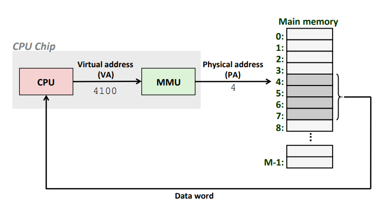
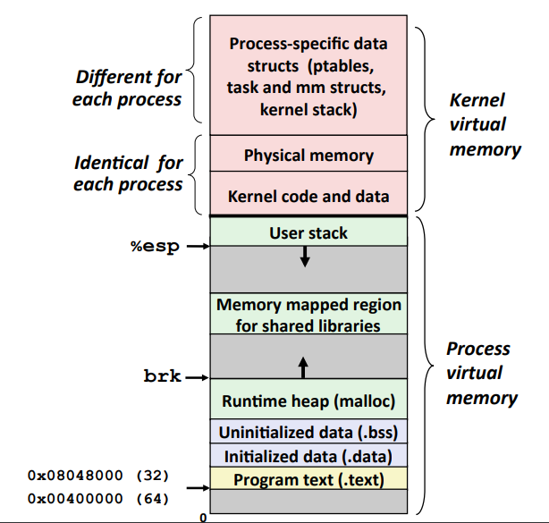
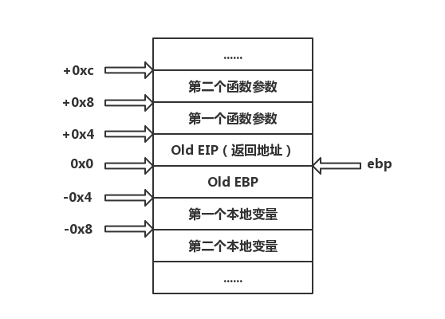

# 1.5.7 内存管理

- [什么是内存](#什么是内存)
- [栈与调用约定](#栈与调用约定)
- [堆与内存管理](#堆与内存管理)


## 什么是内存
为了使用户程序在运行时具有一个私有的地址空间、有自己的 CPU，就像独占了整个计算机一样，现代操作系统提出了虚拟内存的概念。

虚拟内存的主要作用主要为三个：
- 它将内存看做一个存储在磁盘上的地址空间的高速缓存，在内存中只保存活动区域，并根据需要在磁盘和内存之间来回传送数据。
- 它为每个进程提供了一致的地址空间。
- 它保护了每个进程的地址空间不被其他进程破坏。

现代操作系统采用虚拟寻址的方式，CPU 通过生成一个虚拟地址（Virtual Address(VA)）来访问内存，然后这个虚拟地址通过内存管理单元（Memory Management Unit(MMU)）转换成物理地址之后被送到存储器。



前面我们已经看到可执行文件被映射到了内存中，Linux 为每个进程维持了一个单独的虚拟地址空间，包括了 .text、.data、.bss、栈（stack）、堆（heap），共享库等内容。

32 位系统有 4GB 的地址空间，其中 0x08048000~0xbfffffff 是用户空间（3GB），0xc0000000~0xffffffff 是内核空间（１GB）。




## 栈与调用约定
#### 栈
栈是一个先入后出（First In Last Out(FIFO)）的容器。用于存放函数返回地址及参数、临时变量和有关上下文的内容。程序在调用函数时，操作系统会自动通过压栈和弹栈完成保存函数现场等操作，不需要程序员手动干预。

栈由高地址向低地址增长，栈保存了一个函数调用所需要的维护信息，称为堆栈帧（Stack Frame）在 x86 体系中，寄存器 `ebp` 指向堆栈帧的底部，`esp` 指向堆栈帧的顶部。压栈时栈顶地址减小，弹栈时栈顶地址增大。
- `PUSH`：用于压栈。将 `esp` 减 4，然后将其唯一操作数的内容写入到 `esp` 指向的内存地址
- `POP` ：用于弹栈。从 `esp` 指向的内存地址获得数据，将其加载到指令操作数（通常是一个寄存器）中，然后将 `esp` 加 4。

x86 体系下函数的调用总是这样的：
- 把所有或一部分参数压入栈中，如果有其他参数没有入栈，那么使用某些特定的寄存器传递。
- 把当前指令的下一条指令的地址压入栈中。
- 跳转到函数体执行。

其中第 2 步和第 3 步由指令 `call` 一起执行。跳转到函数体之后即开始执行函数，而 x86 函数体的开头是这样的：
- `push ebp`：把ebp压入栈中（old ebp）。
- `mov ebp, esp`：ebp=esp（这时ebp指向栈顶，而此时栈顶就是old ebp）
- [可选] `sub esp, XXX`：在栈上分配 XXX 字节的临时空间。
- [可选] `push XXX`：保存名为 XXX 的寄存器。

把ebp压入栈中，是为了在函数返回时恢复以前的ebp值，而压入寄存器的值，是为了保持某些寄存器在函数调用前后保存不变。函数返回时的操作与开头正好相反：
- [可选] `pop XXX`：恢复保存的寄存器。
- `mov esp, ebp`：恢复esp同时回收局部变量空间。
- `pop ebp`：恢复保存的ebp的值。
- `ret`：从栈中取得返回地址，并跳转到该位置。

栈帧对应的汇编代码：
```text
PUSH ebp          ; 函数开始（使用ebp前先把已有值保存到栈中）
MOV ebp, esp      ; 保存当前esp到ebp中

...       　      ; 函数体
                　; 无论esp值如何变化，ebp都保持不变，可以安全访问函数的局部变量、参数
MOV esp, ebp    　; 将函数的其实地址返回到esp中
POP ebp       　  ; 函数返回前弹出保存在栈中的ebp值
RET              ; 函数返回并跳转
```

函数调用后栈的标准布局如下图：



我们来看一个例子：[源码](../src/Others/1.5.7_stack.c)
```c
#include<stdio.h>
int add(int a, int b) {
    int x = a, y = b;
    return (x + y);
}

int main() {
    int a = 1, b = 2;
    printf("%d\n", add(a, b));
    return 0;
}
```

使用 gdb 查看对应的汇编代码，这里我们给出了详细的注释：
```text
gdb-peda$ disassemble main
Dump of assembler code for function main:
   0x00000563 <+0>:	lea    ecx,[esp+0x4]                      ;将 esp+0x4 的地址传给 ecx
   0x00000567 <+4>:	and    esp,0xfffffff0                     ;栈 16 字节对齐
   0x0000056a <+7>:	push   DWORD PTR [ecx-0x4]                ;ecx-0x4，即原 esp 强制转换为双字数据后压入栈中
   0x0000056d <+10>:	push   ebp                              ;保存调用 main() 函数之前的 ebp，由于在 _start 中将 ebp 清零了，这里的 ebp=0x0
   0x0000056e <+11>:	mov    ebp,esp                          ;把调用 main() 之前的 esp 作为当前栈帧的 ebp
   0x00000570 <+13>:	push   ebx                              ;ebx、ecx 入栈
   0x00000571 <+14>:	push   ecx
   0x00000572 <+15>:	sub    esp,0x10                         ;为局部变量 a、b 分配空间并做到 16 字节对齐
   0x00000575 <+18>:	call   0x440 <__x86.get_pc_thunk.bx>    ;调用 <__x86.get_pc_thunk.bx> 函数，将 esp 强制转换为双字数据后保存到 ebx
   0x0000057a <+23>:	add    ebx,0x1a86                       ;ebx+0x1a86
   0x00000580 <+29>:	mov    DWORD PTR [ebp-0x10],0x1         ;a 第二个入栈所以保存在 ebp-0x10 的位置，此句即 a=1
   0x00000587 <+36>:	mov    DWORD PTR [ebp-0xc],0x2          ;b 第一个入栈所以保存在 ebp-0xc 的位置，此句即 b=2
   0x0000058e <+43>:	push   DWORD PTR [ebp-0xc]              ;将 b 压入栈中
   0x00000591 <+46>:	push   DWORD PTR [ebp-0x10]             ;将 a 压入栈中
   0x00000594 <+49>:	call   0x53d <add>                      ;调用 add() 函数，返回值保存在 eax 中
   0x00000599 <+54>:	add    esp,0x8                          ;清理 add() 的参数
   0x0000059c <+57>:	sub    esp,0x8                          ;调整 esp 使 16 位对齐
   0x0000059f <+60>:	push   eax                              ;eax 入栈
   0x000005a0 <+61>:	lea    eax,[ebx-0x19b0]                 ;ebx-0x19b0 的地址保存到 eax，该地址处保存字符串 "%d\n"
   0x000005a6 <+67>:	push   eax                              ;eax 入栈
   0x000005a7 <+68>:	call   0x3d0 <printf@plt>               ;调用 printf() 函数
   0x000005ac <+73>:	add    esp,0x10                         ;调整栈顶指针 esp，清理 printf() 的参数
   0x000005af <+76>:	mov    eax,0x0                          ;eax=0x0
   0x000005b4 <+81>:	lea    esp,[ebp-0x8]                    ;ebp-0x8 的地址保存到 esp
   0x000005b7 <+84>:	pop    ecx                              ;弹栈恢复 ecx、ebx、ebp
   0x000005b8 <+85>:	pop    ebx
   0x000005b9 <+86>:	pop    ebp
   0x000005ba <+87>:	lea    esp,[ecx-0x4]                    ;ecx-0x4 的地址保存到 esp
   0x000005bd <+90>:	ret                                     ;返回，相当于 pop eip;
End of assembler dump.
gdb-peda$ disassemble add
Dump of assembler code for function add:
   0x0000053d <+0>:	push   ebp                                ;保存调用 add() 函数之前的 ebp
   0x0000053e <+1>:	mov    ebp,esp                            ;把调用 add() 之前的 esp 作为当前栈帧的 ebp
   0x00000540 <+3>:	sub    esp,0x10                           ;为局部变量 x、y 分配空间并做到 16 字节对齐
   0x00000543 <+6>:	call   0x5be <__x86.get_pc_thunk.ax>      ;调用 <__x86.get_pc_thunk.ax> 函数，将 esp 强制转换为双字数据后保存到 eax
   0x00000548 <+11>:	add    eax,0x1ab8                       ;eax+0x1ab8
   0x0000054d <+16>:	mov    eax,DWORD PTR [ebp+0x8]          ;将 ebp+0x8 的数据 0x1 传送到 eax，ebp+0x4 为函数返回地址
   0x00000550 <+19>:	mov    DWORD PTR [ebp-0x8],eax          ;保存 eax 的值 0x1 到 ebp-0x8 的位置
   0x00000553 <+22>:	mov    eax,DWORD PTR [ebp+0xc]          ;将 ebp+0xc 的数据 0x2 传送到 eax
   0x00000556 <+25>:	mov    DWORD PTR [ebp-0x4],eax          ;保存 eax 的值 0x2 到 ebp-0x4 的位置
   0x00000559 <+28>:	mov    edx,DWORD PTR [ebp-0x8]          ;取出 ebp-0x8 的值 0x1 到 edx
   0x0000055c <+31>:	mov    eax,DWORD PTR [ebp-0x4]          ;取出 ebp-0x4 的值 0x2 到 eax
   0x0000055f <+34>:	add    eax,edx                          ;eax+edx
   0x00000561 <+36>:	leave                                   ;返回，相当于 mov esp,ebp; pop ebp;
   0x00000562 <+37>:	ret    
End of assembler dump.
```
这里我们在 Linux 环境下，由于 ELF 文件的入口其实是 `_start` 而不是 `main()`，所以我们还应该关注下面的函数：
```text
gdb-peda$ disassemble _start
Dump of assembler code for function _start:
   0x00000400 <+0>:	xor    ebp,ebp                            ;清零 ebp，表示下面的 main() 函数栈帧中 ebp 保存的上一级 ebp 为 0x00000000
   0x00000402 <+2>:	pop    esi                                ;将 argc 存入 esi
   0x00000403 <+3>:	mov    ecx,esp                            ;将栈顶地址（argv 和 env 数组的其实地址）传给 ecx
   0x00000405 <+5>:	and    esp,0xfffffff0                     ;栈 16 字节对齐
   0x00000408 <+8>:	push   eax                                ;eax、esp、edx 入栈
   0x00000409 <+9>:	push   esp
   0x0000040a <+10>:	push   edx
   0x0000040b <+11>:	call   0x432 <_start+50>                ;先将下一条指令地址 0x00000410 压栈，设置 esp 指向它，再调用 0x00000432 处的指令
   0x00000410 <+16>:	add    ebx,0x1bf0                       ;ebx+0x1bf0
   0x00000416 <+22>:	lea    eax,[ebx-0x19d0]                 ;取 <__libc_csu_fini> 地址传给 eax，然后压栈
   0x0000041c <+28>:	push   eax
   0x0000041d <+29>:	lea    eax,[ebx-0x1a30]                 ;取 <__libc_csu_init> 地址传入 eax，然后压栈
   0x00000423 <+35>:	push   eax                              
   0x00000424 <+36>:	push   ecx                              ;ecx、esi 入栈保存
   0x00000425 <+37>:	push   esi
   0x00000426 <+38>:	push   DWORD PTR [ebx-0x8]              ;调用 main() 函数之前保存返回地址，其实就是保存 main() 函数的入口地址
   0x0000042c <+44>:	call   0x3e0 <__libc_start_main@plt>    ;call 指令调用 __libc_start_main 函数
   0x00000431 <+49>:	hlt                                     ;hlt 指令使程序停止运行，处理器进入暂停状态，不执行任何操作，不影响标志。当 RESET 线上有复位信号、CPU 响应非屏蔽终端、CPU 响应可屏蔽终端 3 种情况之一时，CPU 脱离暂停状态，执行下一条指令
   0x00000432 <+50>:	mov    ebx,DWORD PTR [esp]              ;esp 强制转换为双字数据后保存到 ebx
   0x00000435 <+53>:	ret                                     ;返回，相当于 pop eip;
   0x00000436 <+54>:	xchg   ax,ax                            ;交换 ax 和 ax 的数据，相当于 nop
   0x00000438 <+56>:	xchg   ax,ax
   0x0000043a <+58>:	xchg   ax,ax
   0x0000043c <+60>:	xchg   ax,ax
   0x0000043e <+62>:	xchg   ax,ax
End of assembler dump.
```

#### 函数调用约定
函数调用约定是对函数调用时如何传递参数的一种约定。调用函数前要先把参数压入栈然后再传递给函数。

一个调用约定大概有如下的内容：
- 函数参数的传递顺序和方式
- 栈的维护方式
- 名字修饰的策略

主要的函数调用约定如下，其中 cdecl 是 C 语言默认的调用约定：

调用约定 | 出栈方 | 参数传递 | 名字修饰
--- | --- | --- | ---
cdecl | 函数调用方 | 从右到左的顺序压参数入栈 | 下划线＋函数名
stdcall | 函数本身 | 从右到左的顺序压参数入栈 | 下划线＋函数名＋@＋参数的字节数
fastcall | 函数本身 | 都两个 DWORD（4 字节）类型或者占更少字节的参数被放入寄存器，其他剩下的参数按从右到左的顺序压入栈 | @＋函数名＋@＋参数的字节数

除了参数的传递之外，函数与调用方还可以通过返回值进行交互。当返回值不大于 4 字节时，返回值存储在 eax 寄存器中，当返回值在 5~8 字节时，采用 eax 和 edx 结合的形式返回，其中 eax 存储低 4 字节， edx 存储高 4 字节。


## 堆与内存管理
#### 堆


堆是用于存放除了栈里的东西之外所有其他东西的内存区域，有动态内存分配器负责维护。分配器将堆视为一组不同大小的块（block）的集合来维护，每个块就是一个连续的虚拟内存器片（chunk）。当使用 `malloc()` 和 `free()` 时就是在操作堆中的内存。对于堆来说，释放工作由程序员控制，容易产生内存泄露。

堆是向高地址扩展的数据结构，是不连续的内存区域。这是由于系统是用链表来存储的空闲内存地址的，而链表的遍历方向是由低地址向高地址。堆的大小受限于计算机系统中有效的虚拟内存。由此可见，堆获得的空间比较灵活，也比较大。

如果每次申请内存时都直接使用系统调用，会严重影响程序的性能。通常情况下，运行库先向操作系统“批发”一块较大的堆空间，然后“零售”给程序使用。当全部“售完”之后或者剩余空间不能满足程序的需求时，再根据情况向操作系统“进货”。

#### 进程堆管理
Linux 提供了两种堆空间分配的方式，一个是 `brk()` 系统调用，另一个是 `mmap()` 系统调用。可以使用 `man brk`、`man mmap` 查看。

`brk()` 的声明如下：
```c
#include <unistd.h>

int brk(void *addr);

void *sbrk(intptr_t increment);
```
参数 `*addr` 是进程数据段的结束地址，`brk()` 通过改变该地址来改变数据段的大小，当结束地址向高地址移动，进程内存空间增大，当结束地址向低地址移动，进程内存空间减小。`brk()`调用成功时返回 0，失败时返回 -1。 `sbrk()` 与 `brk()` 类似，但是参数 `increment` 表示增量，即增加或减少的空间大小，调用成功时返回增加后减小前数据段的结束地址，失败时返回 -1。

在上图中我们看到 brk 指示堆结束地址，start_brk 指示堆开始地址。BSS segment 和 heap 之间有一段 Random brk offset，这是由于 ASLR 的作用，如果关闭了 ASLR，则 Random brk offset 为 0，堆结束地址和数据段开始地址重合。

例子：[源码](../src/Others/1.5.7_brk.c)
```
#include <stdio.h>
#include <unistd.h>
void main() {
        void *curr_brk, *tmp_brk, *pre_brk;

        printf("当前进程 PID：%d\n", getpid());

        tmp_brk = curr_brk = sbrk(0);
        printf("初始化后的结束地址：%p\n", curr_brk);
        getchar();

        brk(curr_brk+4096);
        curr_brk = sbrk(0);
        printf("brk 之后的结束地址：%p\n", curr_brk);
        getchar();

        pre_brk = sbrk(4096);
        curr_brk = sbrk(0);
        printf("sbrk 返回值（即之前的结束地址）：%p\n", pre_brk);
        printf("sbrk 之后的结束地址：%p\n", curr_brk);
        getchar();

        brk(tmp_brk);
        curr_brk = sbrk(0);
        printf("恢复到初始化时的结束地址：%p\n", curr_brk);
        getchar();
}
```
开启两个终端，一个用于执行程序，另一个用于观察内存地址。首先我们看关闭了 ASLR 的情况。第一步初始化：
```text
# echo 0 > /proc/sys/kernel/randomize_va_space
```
```text
$ ./a.out
当前进程 PID：27759
初始化后的结束地址：0x56579000
```
```text
# cat /proc/27759/maps
...
56557000-56558000 rw-p 00001000 08:01 28587506                           /home/a.out
56558000-56579000 rw-p 00000000 00:00 0                                  [heap]
...
```
数据段结束地址和堆开始地址同为 `0x56558000`，堆结束地址为 `0x56579000`。

第二步使用 `brk()` 增加堆空间：
```text
$ ./a.out
当前进程 PID：27759
初始化后的结束地址：0x56579000

brk 之后的结束地址：0x5657a000
```
```text
# cat /proc/27759/maps
...
56557000-56558000 rw-p 00001000 08:01 28587506                           /home/a.out
56558000-5657a000 rw-p 00000000 00:00 0                                  [heap]
...
```
堆开始地址不变，结束地址增加为 `0x5657a000`。

第三步使用 `sbrk()` 增加堆空间：
```text
$ ./a.out
当前进程 PID：27759
初始化后的结束地址：0x56579000

brk 之后的结束地址：0x5657a000

sbrk 返回值（即之前的结束地址）：0x5657a000
sbrk 之后的结束地址：0x5657b000
```
```text
# cat /proc/27759/maps
...
56557000-56558000 rw-p 00001000 08:01 28587506                           /home/a.out
56558000-5657b000 rw-p 00000000 00:00 0                                  [heap]
...
```

第四步减小堆空间：
```text
]$ ./a.out
当前进程 PID：27759
初始化后的结束地址：0x56579000

brk 之后的结束地址：0x5657a000

sbrk 返回值（即之前的结束地址）：0x5657a000
sbrk 之后的结束地址：0x5657b000

恢复到初始化时的结束地址：0x56579000
```
```text
# cat /proc/27759/maps
...
56557000-56558000 rw-p 00001000 08:01 28587506                           /home/a.out
56558000-56579000 rw-p 00000000 00:00 0                                  [heap]
...
```

再来看一下开启了 ASLR 的情况：
```text
# echo 2 > /proc/sys/kernel/randomize_va_space
```
```text
]$ ./a.out
当前进程 PID：28025
初始化后的结束地址：0x578ad000
```
```text
# cat /proc/28025/maps
...
5663f000-56640000 rw-p 00001000 08:01 28587506                           /home/a.out
5788c000-578ad000 rw-p 00000000 00:00 0                                  [heap]
...
```
可以看到这时数据段的结束地址 `0x56640000` 不等于堆的开始地址 `0x5788c000`。

`mmap()` 的声明如下：
```c
#include <sys/mman.h>

void *mmap(void *addr, size_t len, int prot, int flags,
    int fildes, off_t off);
```
`mmap()` 函数用于创建新的虚拟内存区域，并将对象映射到这些区域中，当它不将地址空间映射到某个文件时，我们称这块空间为匿名（Anonymous）空间，匿名空间可以用来作为堆空间。`mmap()` 函数要求内核创建一个从地址 `addr` 开始的新虚拟内存区域，并将文件描述符 `fildes` 指定的对象的一个连续的片（chunk）映射到这个新区域。连续的对象片大小为 `len` 字节，从距文件开始处偏移量为 `off` 字节的地方开始。`prot` 描述虚拟内存区域的访问权限位，`flags` 描述被映射对象类型的位组成。

`munmap()` 则用于删除虚拟内存区域：
```c
#include <sys/mman.h>

int munmap(void *addr, size_t len);
```

例子：[源码](../src/Others/1.5.7_mmap.c)
```
#include <stdio.h>
#include <sys/mman.h>
#include <unistd.h>
void main() {
        void *curr_brk;

        printf("当前进程 PID：%d\n", getpid());
        printf("初始化后\n");
        getchar();

        char *addr;
        addr = mmap(NULL, (size_t)4096, PROT_READ|PROT_WRITE, MAP_PRIVATE | MAP_ANONYMOUS, 0, 0);
        printf("mmap 完成\n");
        getchar();

        munmap(addr, (size_t)4096);
        printf("munmap 完成\n");
        getchar();
}
```
第一步初始化：
```text
$ ./a.out
当前进程 PID：28652
初始化后
```
```text
# cat /proc/28652/maps
...
f76b2000-f76b5000 rw-p 00000000 00:00 0
f76ef000-f76f1000 rw-p 00000000 00:00 0
...
```
第二步 mmap：
```text
]$ ./a.out
当前进程 PID：28652
初始化后
mmap 完成
```
```text
# cat /proc/28652/maps
...
f76b2000-f76b5000 rw-p 00000000 00:00 0
f76ee000-f76f1000 rw-p 00000000 00:00 0
...
```
第三步 munmap：
```text
$ ./a.out
当前进程 PID：28652
初始化后
mmap 完成
munmap 完成
```
```text
# cat /proc/28652/maps
...
f76b2000-f76b5000 rw-p 00000000 00:00 0
f76ef000-f76f1000 rw-p 00000000 00:00 0
...
```
可以看到第二行第一列地址从 `f76ef000`->`f76ee000`->`f76ef000` 变化。`0xf76ee000-0xf76ef000=0x1000=4096`。

通常情况下，我们不会直接使用 `brk()` 和 `mmap()` 来分配堆空间，C 标准库提供了一个叫做 `malloc` 的分配器，程序通过调用 `malloc()` 函数来从堆中分配块，声明如下：
```c
#include <stdlib.h>

void *malloc(size_t size);
void free(void *ptr);
void *calloc(size_t nmemb, size_t size);
void *realloc(void *ptr, size_t size);
```

示例：
```
#include<stdio.h>
#include<malloc.h>
void foo(int n) {
	int *p;
	p = (int *)malloc(n * sizeof(int));

	for (int i=0; i<n; i++) {
		p[i] = i;
		printf("%d ", p[i]);
	}
	printf("\n");

	free(p);
}

void main() {
	int n;
	scanf("%d", &n);

	foo(n);
}
```

运行结果：
```text
$ ./malloc
4
0 1 2 3
$ ./malloc
8
0 1 2 3 4 5 6 7
$ ./malloc
16
0 1 2 3 4 5 6 7 8 9 10 11 12 13 14 15
```

使用 gdb 查看反汇编代码：
```text
gdb-peda$ disassemble foo
Dump of assembler code for function foo:
   0x0000066d <+0>:	push   ebp
   0x0000066e <+1>:	mov    ebp,esp
   0x00000670 <+3>:	push   ebx
   0x00000671 <+4>:	sub    esp,0x14
   0x00000674 <+7>:	call   0x570 <__x86.get_pc_thunk.bx>
   0x00000679 <+12>:	add    ebx,0x1987
   0x0000067f <+18>:	mov    eax,DWORD PTR [ebp+0x8]
   0x00000682 <+21>:	shl    eax,0x2
   0x00000685 <+24>:	sub    esp,0xc
   0x00000688 <+27>:	push   eax
   0x00000689 <+28>:	call   0x4e0 <malloc@plt>
   0x0000068e <+33>:	add    esp,0x10
   0x00000691 <+36>:	mov    DWORD PTR [ebp-0xc],eax
   0x00000694 <+39>:	mov    DWORD PTR [ebp-0x10],0x0
   0x0000069b <+46>:	jmp    0x6d9 <foo+108>
   0x0000069d <+48>:	mov    eax,DWORD PTR [ebp-0x10]
   0x000006a0 <+51>:	lea    edx,[eax*4+0x0]
   0x000006a7 <+58>:	mov    eax,DWORD PTR [ebp-0xc]
   0x000006aa <+61>:	add    edx,eax
   0x000006ac <+63>:	mov    eax,DWORD PTR [ebp-0x10]
   0x000006af <+66>:	mov    DWORD PTR [edx],eax
   0x000006b1 <+68>:	mov    eax,DWORD PTR [ebp-0x10]
   0x000006b4 <+71>:	lea    edx,[eax*4+0x0]
   0x000006bb <+78>:	mov    eax,DWORD PTR [ebp-0xc]
   0x000006be <+81>:	add    eax,edx
   0x000006c0 <+83>:	mov    eax,DWORD PTR [eax]
   0x000006c2 <+85>:	sub    esp,0x8
   0x000006c5 <+88>:	push   eax
   0x000006c6 <+89>:	lea    eax,[ebx-0x17e0]
   0x000006cc <+95>:	push   eax
   0x000006cd <+96>:	call   0x4b0 <printf@plt>
   0x000006d2 <+101>:	add    esp,0x10
   0x000006d5 <+104>:	add    DWORD PTR [ebp-0x10],0x1
   0x000006d9 <+108>:	mov    eax,DWORD PTR [ebp-0x10]
   0x000006dc <+111>:	cmp    eax,DWORD PTR [ebp+0x8]
   0x000006df <+114>:	jl     0x69d <foo+48>
   0x000006e1 <+116>:	sub    esp,0xc
   0x000006e4 <+119>:	push   0xa
   0x000006e6 <+121>:	call   0x500 <putchar@plt>
   0x000006eb <+126>:	add    esp,0x10
   0x000006ee <+129>:	sub    esp,0xc
   0x000006f1 <+132>:	push   DWORD PTR [ebp-0xc]
   0x000006f4 <+135>:	call   0x4c0 <free@plt>
   0x000006f9 <+140>:	add    esp,0x10
   0x000006fc <+143>:	nop
   0x000006fd <+144>:	mov    ebx,DWORD PTR [ebp-0x4]
   0x00000700 <+147>:	leave  
   0x00000701 <+148>:	ret    
End of assembler dump.
```
关于 glibc 中的 malloc 实现是一个很重要的话题，我们会在后面的章节详细介绍。
