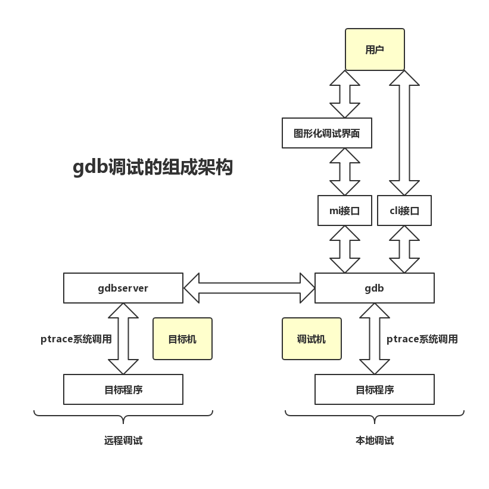

# 2.1 gdb 和 peda 调试器

- [gdb 的组成架构](#gdb-的组成架构)
- [gdb 基本工作原理](#gdb-基本工作原理)
- [gdb 基本操作](#gdb-基本操作)
- [gdb-peda](#gdb-peda)
- [GEF/pwndbg](#gefpwndbg)


## gdb 的组成架构



## gdb 基本工作原理
gdb 通过系统调用 `ptrace` 来接管一个进程的执行。ptrace 系统调用提供了一种方法使得父进程可以观察和控制其它进程的执行，检查和改变其核心映像以及寄存器。它主要用来实现断点调试和系统调用跟踪。ptrace 系统调用的原型如下：
```
#include <sys/ptrace.h>
long ptrace(enum __ptrace_request request, pid_t pid, void *addr, void *data);
```
- **pid_t pid**：指示 ptrace 要跟踪的进程。
- **void *addr**：指示要监控的内存地址。
- **void *data**：存放读取出的或者要写入的数据。
- **enum __ptrace_request request**：决定了系统调用的功能，几个主要的选项：
  - *PTRACE_TRACEME*：表示此进程将被父进程跟踪，任何信号（除了 `SIGKILL`）都会暂停子进程，接着阻塞于 `wait()` 等待的父进程被唤醒。子进程内部对 `exec()` 的调用将发出 `SIGTRAP` 信号，这可以让父进程在子进程新程序开始运行之前就完全控制它。
  - *PTRACE_ATTACH*：attach 到一个指定的进程，使其成为当前进程跟踪的子进程，而子进程的行为等同于它进行了一次 PTRACE_TRACEME 操作。但需要注意的是，虽然当前进程成为被跟踪进程的父进程，但是子进程使用 `getppid()` 的到的仍将是其原始父进程的 pid。
  - *PTRACE_CONT*：继续运行之前停止的子进程。可同时向子进程交付指定的信号。

#### gdb 的三种调试方式
- 运行并调试一个新进程
  - 运行 gdb，通过命令行或 `file` 命令指定目标程序。
  - 输入 `run` 命令， gdb 执行下面的操作：
    - 通过 `fork()` 系统调用创建一个新进程
    - 在新创建的子进程中执行操作：`ptrace(PTRACE_TRACEME, 0, 0, 0)`
    - 在子进程中通过 `execv()` 系统调用加载用户指定的可执行文件
- attach 并调试一个已经运行的进程
  - 用户确定需要进行调试的进程 PID
  - 运行 gdb，输入 `attach <pid>`，gdb 将对指定进程执行操作：`ptrace(PTRACE_ATTACH, pid, 0, 0)`
- 远程调试目标机上新创建的进程
  - gdb 运行在调试机上，gdbserver 运行在目标机上，两者之间的通信数据格式由 gdb 远程串行协议（Remote Serial Protocol）定义
  - RSP 协议数据的基本格式为： `$..........#xx`
  - gdbserver 的启动方式相当于运行并调试一个新创建的进程

#### 断点的实现
断点的功能是通过内核信号实现的，在 x86 架构上，内核向某个地址打入断点，实际上就是往该地址写入断点指令 `INT 3`，即 `0xCC`。目标程序运行到这条指令之后会触发 `SIGTRAP` 信号，gdb 捕获这个信号，并根据目标程序当前停止的位置查询 gdb 维护的断点链表，若发现在该地址确实存在断点，则可判定为断点命中。


## gdb 基本操作
使用 `-tui` 选项可以将代码显示在一个漂亮的交互式窗口中。

#### break -- b
- `break` 当不带参数时，在所选栈帧中执行的下一条指令处设置断点。
- `break <function>` 在函数体入口处打断点。
- `break <line>` 在当前源码文件指定行的开始处打断点。
- `break -N` `break +N` 在当前源码行前面或后面的 `N` 行开始处打断点，`N` 为正整数。
- `break <filename:line>` 在源码文件 `filename` 的 `line` 行处打断点。
- `break <filename:function>` 在源码文件 `filename` 的 `function` 函数入口处打断点。
- `break <address>` 在程序指令的地址处打断点。
- `break ... if <cond>` 设置条件断点，`...` 代表上述参数之一（或无参数），`cond` 为条件表达式，仅在 `cond` 值非零时停住程序。

#### info breakpoints -- i b
查看断点，观察点和捕获点的列表。用法：
- `info breakpoints [list…]`
- `info break [list…]`

`list…` 用来指定若干个断点的编号（可省略），可以是 `2`， `1-3`， `2 5` 等。

#### disable -- dis
禁用断点，参数使用空格分隔。不带参数时禁用所有断点。
- `disable [breakpoints] [list…]` `breakpoints` 是 `disable` 的子命令（可省略），`list…` 同 `info breakpoints` 中的描述。

#### enable
启用断点，参数使用空格分隔。不带参数时启用所有断点。
- `enable [breakpoints] [list…]` 启用指定的断点（或所有定义的断点）。
- `enable [breakpoints] once list…` 临时启用指定的断点。GDB 在停止您的程序后立即禁用这些断点。
- `enable [breakpoints] delete list…` 使指定的断点启用一次，然后删除。一旦您的程序停止，GDB 就会删除这些断点。等效于用 `tbreak` 设置的断点。

`breakpoints` 同 `disable` 中的描述。

#### clear
在指定行或函数处清除断点。参数可以是行号，函数名称或 `*` 跟一个地址。
- `clear` 当不带参数时，清除所选栈帧在执行的源码行中的所有断点。
- `clear <function>`, `clear <filename:function>` 删除在命名函数的入口处设置的任何断点。
- `clear <line>`, `clear <filename:line>` 删除在指定的文件指定的行号的代码中设置的任何断点。
- `clear <address>` 清除指定程序指令的地址处的断点。

#### delete -- d
删除断点。参数使用空格分隔。不带参数时删除所有断点。
- `delete [breakpoints] [list…]`

#### tbreak
设置临时断点。参数形式同 `break` 一样。当第一次命中时被删除。

#### watch

#### step -- s

#### reverse-step

#### next -- n

#### reverse-next

#### return

#### finish -- fin

#### until -- u

#### continue -- c

#### print -- p

#### x

#### display

#### info display

#### disable display

#### enable display

#### undisplay

#### help -- h

#### attach

#### run -- r

#### backtrace -- bt

#### ptype

注意：使用 gdb 调试时，会自动关闭 ASLR，所以可能每次看到的栈地址都不变。


## gdb-peda

#### 安装
```shell
$ git clone https://github.com/longld/peda.git ~/peda
$ echo "source ~/peda/peda.py" >> ~/.gdbinit
$ echo "DONE! debug your program with gdb and enjoy"
```

如果系统为 Arch Linux，则可以直接安装：
```shell
$ yaourt -S peda
```

#### peda命令
- `aslr` - 显示/设置 gdb 的 ASLR
- `checksec` - 检查二进制文件的安全选项
- `dumpargs` - 在调用指令停止时显示传递给函数的参数
- `dumprop` - 在特定的内存范围显示 ROP gadgets
- `elfheader` - 获取正在调试的 ELF 文件的头信息
- `elfsymbol` - 从 ELF 文件中获取没有调试信息的符号信息
- `lookup` - 搜索属于内存范围的地址的所有地址/引用
- `patch` - 使用字符串/十六进制字符串/整形数
- `pattern` - 生成，搜索或写入循环 pattern 到内存
- `procinfo`  - 显示调试进程的 /proc/pid/
- `pshow` - 显示各种 PEDA 选项和其他设置
- `pset` - 设置各种PEDA选项和其他设置
- `readelf` - 获取 ELF 的文件头信息
- `ropgadget` - 获取二进制或库的常见 ROP gadgets
- `ropsearch` - 搜索内存中的 ROP gadgets
- `searchmem|find` - 搜索内存中的 pattern; 支持正则表达式搜索
- `shellcode` - 生成或下载常见的 shellcode
- `skeleton` - 生成 python exploit 代码模板
- `vmmap` - 在调试过程中获取段的虚拟映射地址范围
- `xormem` - 用一个 key 来对一个内存区域执行 XOR 操作


## GEF/pwndbg
除了 peda 外还有一些优秀的 gdb 增强工具，功能大致相同，可以看情况选用。
- [GEF](https://github.com/hugsy/gef) - Multi-Architecture GDB Enhanced Features for Exploiters & Reverse-Engineers
- [pwndbg](https://github.com/pwndbg/pwndbg) - Exploit Development and Reverse Engineering with GDB Made Easy
