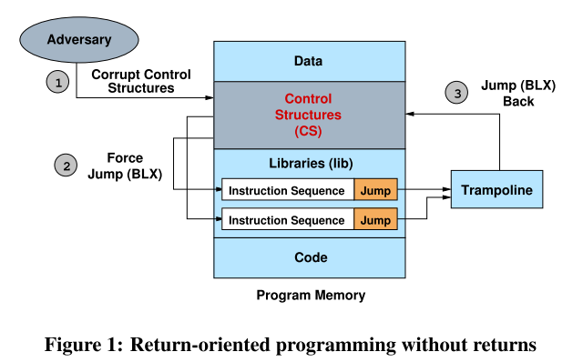

# 4.5 ROP 防御技术

- [早期的防御技术](#早期的防御技术)
- [没有 return 的 ROP](#没有-return-的-rop)
- [参考资料](#参考资料)


## 早期的防御技术
前面我们已经学过各种 ROP 技术，但同时很多防御技术也被提出来，这一节我们就来看一下这些技术。

我们知道正常程序的指令流执行和 ROP 的指令流执行有很大不同，至少有下面两点：
- ROP 执行流会包含了很多 return 指令，而且之间只间隔了几条其他指令
- ROP 利用 return 指令来 unwind 堆栈，却没有对应的 call 指令

以上面两点差异作为基础，研究人员提出了很多 ROP 检测和防御技术：
- 针对第一点差异，可以检测程序执行中是否有频繁 return 的指令流，作为报警的依据
- 针对第二点差异，可以通过 call 和 return 指令来查找正常程序中通常都存在的后进先出栈里维护的不变量，判断其是否异常
- 还有更极端的，在编译器层面重写二进制文件，消除里面的 return 指令

所以其实这些早期的防御技术都默认了一个前提，即 ROP 中必定存在 return 指令。

另外对于重写二进制文件消除 return 指令的技术，根据二进制偏移也可能会得到攻击者需要的非预期指令，比如下面这段指令：
```
b8 13 00 00 00  mov $0x13, %eax
e9 c3 f8 ff ff  jmp 3aae9
```
偏移两个十六进制得到下面这样：
```
00 00   add %al, (%eax)
00 e9   add %ch, %cl
c3      ret
```
最终还是出现了 return 指令。


## 没有 return 的 ROP
后来又有人提出了不依赖于 return 指令的 ROP，使得早期的防御技术完全失效。return 指令的作用主要有两个：第一通过间接跳转改变执行流，第二是更新寄存器状态。在 x86 和 ARM 中都存在一些指令序列，也能够完成这些工作，它们首先更新全局状态（如栈指针），然后根据更新后的状态加载下一条指令序列的地址，最后跳转过去执行（把它叫做 update-load-branch 指令序列）。这样就避免的 return 指令的使用。

就像下面这样，`x` 代表任意的通用寄存器：
```
pop x
jmp *x
```
`r6` 通用寄存器里是更新后的状态：
```
adds r6, #4
ldr r5, [r6, #124]
blx r5
```

由于 update-load-branch 指令序列相比 return 指令更加稀少，所以需要把它作为 trampoline 重复利用。在构造 ROP 链时，选择以 trampoline 为目标的间接跳转指令结束的指令序列。当一个 gadget 执行结束后，跳转到 trampoline，trampoline 更新程序全局状态，并将程序控制交给下一个 gadget，这样就形成了 ROP 链。




## 参考资料
- [Return-Oriented Programming without Returns](https://www2.cs.uic.edu/~s/papers/noret_ccs2010/noret_ccs2010.pdf)
- [Analysis of Defenses against Return Oriented Programming](http://www.eit.lth.se/sprapport.php?uid=829)
