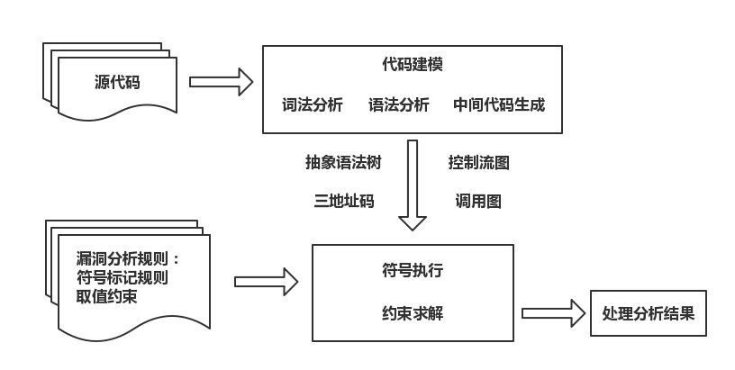

# 5.3 符号执行

- [基本原理](#基本原理)
- [参考资料](#参考资料)


## 基本原理
符号执行起初应用于基于源代码的安全检测中，它通过符号表达式来模拟程序的执行，将程序的输出表示成包含这些符号的逻辑或数学表达式，从而进行语义分析。

符号执行可分为过程内分析和过程间分析（或全局分析）。过程内分析是指只对单个函数的代码进行分析，过程间分析是指在当前函数入口点要考虑当前函数的调用信息和环境信息等。当符号执行用于代码漏洞静态检测时，更多的是进行程序全局的分析且更侧重代码的安全性相关的检测。将符号执行与约束求解器结合使用来产生测试用例是一个比较热门的研究方向。（关于约束求解我们会在另外的章节中详细讲解）

符号执行具有代价小、效率高的有点，但缺点也是很明显的。比如路径状态空间的爆炸问题，由于每一个条件分支语句都可能会使当前路径再分出一条新的路径，特别是遇到循环分支时，每增加一次循环都将增加一条新路径，因此这种增长是指数级的。在实践中，通常采用一些这种的办法来解决路径爆炸问题，比如规定每个过程内的分析路径的数目上限，或者设置时间上限和内存上限等来进行缓解。

**动态符号执行**将符号执行和具体执行结合起来，并交替使用静态分析和动态分析，在具体执行的同时堆执行到的指令进行符号化执行。

每一个符号执行的路径都是一个 true 和 false 组成的序列，其中第 i 个 true（或false）表示在该路径的执行中遇到的第 i 个条件语句。一个程序所有的执行路径可以用执行树（Execution Tree）表示。举一个例子：
```c
int twice(int v) {
    return 2*v;
}

void testme(int x, int y) {
    z = twice(y);
    if (z == x) {
        if (x > y+10) {
            ERROR;
        }
    }
}

int main() {
    x = sym_input();
    y = sym_input();
    testme(x, y);
    return 0;
}
```
这段代码的执行树如下图所示，图中的三条路径分别可以被输入 {x = 0, y = 1}、{x = 2, y = 1} 和 {x = 30, y = 15} 触发：


符号执行中维护了符号状态 σ 和符号路径约束 PC，其中 σ 表示变量到符号表达式的映射，PC 是符号表示的不含量词的一阶表达式。在符号执行的初始化阶段，σ 被初始化为空映射，而 PC 被初始化为 true，并随着符号执行的过程不断变化。在对程序的某一路径分支进行符号执行的终点，把 PC 输入约束求解器以获得求解。如果程序把生成的具体值作为输入执行，它将会和符号执行运行在同一路径，并且以同一种方式结束。

例如上面的程序中 σ 和 PC 变化过程如下：
```
开始：  σ = NULL                    PC = true
第6行： σ = x->x0, y->y0, z->2y0    PC = true
遇到if(e)then{}else{}：σ = x->x0, y->y0    then分支：PC = PC∧σ(e) else分支：PC' = PC∧¬σ(e)
```

于是我们发现，在符号执行中，对于分析过程所遇到的程序中带有条件的控制转移语句，可以利用变量的符号表达式将控制转移语句中的条件转化为对符号取值的约束，通过分析约束是否满足来判断程序的某条路径是否可行。这样的过程也叫作路径的可行性分析，它是符号执行的关键部分，我们常常将符号取值约束的求解问题转化为一阶逻辑的可满足性问题，从而使用可满足性模理论（SMT）求解器对约束进行求解。

#### 检测程序漏洞
程序中变量的取值可以被表示为符号值和常量组成的计算表达式，而一些程序漏洞可以表现为某些相关变量的取值不满足相应的约束，这时通过判断表示变量取值的表达式是否可以满足相应的约束，就可以判断程序是否存在相应的漏洞。

使用符号执行检测程序漏洞的原理如下图所示：



举个数组越界的例子：
```c
int a[10];
scanf("%d", &i);
if (i > 0) {
    if (i > 10)
        i = i % 10;
    a[i] = 1;
}
```
首先，将表示程序输入的变量 i 用符号 x 表示其取值，通过分别对 if 条件语句的两条分支进行分析，可以发现在赋值语句 a[i] = 1 处，当 x 的取值大于 0、小于 10 时，变量 i 的取值为 x，当 x 的取值大于 10 时，变量 i 的取值为 x % 10。通过分析约束 `(x>10∨x<10)∧(0<x∧x<10)` 和约束 `(x%10>10∨x%10<10)∧x>10` 的可满足性，可以发现漏洞的约束是不可满足的，于是认为漏洞不存在。

#### 构造测试用例
在符号执行的分析过程中，可以不断地获得程序可能执行路径上对程序输入的约束，在分析停止时，利用获得的对程序输入的一系列限制条件，构造满足限制条件的程序输入作为测试用例。

在模拟程序执行并收集路径条件的过程中，如果同时收集可引起程序异常的符号取值的限制条件，并将异常条件和路径条件一起考虑，精心构造满足条件的测试用例作为程序的输入，那么在使用这样的输入的情况下，程序很可能在运行时出现异常。


## 方法实现


## 参考资料
- [History of symbolic execution](https://github.com/enzet/symbolic-execution)
