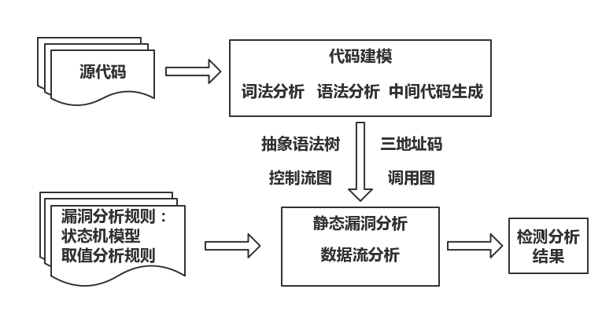

# 5.4 数据流分析

- [基本原理](#基本原理)
- [方法实现](#方法实现)


## 基本原理
数据流分析是一种用来获取相关数据沿着程序执行路径流动的信息分析技术。分析对象是程序执行路径上的数据流动或可能的取值。

#### 数据流分析的分类
根据对程序路径的分析精度分类：
- 流不敏感分析（flow insensitive）：不考虑语句的先后顺序，按照程序语句的物理位置从上往下顺序分析每一语句，忽略程序中存在的分支
- 流敏感分析（flow sensitive）：考虑程序语句可能的执行顺序，通常需要利用程序的控制流图（CFG）
- 路径敏感分析（path sensitive）：不仅考虑语句的先后顺序，还对程序执行路径条件加以判断，以确定分析使用的语句序列是否对应着一条可实际运行的程序执行路径

根据分析程序路径的深度分类：
- 过程内分析（intraprocedure analysis）：只针对程序中函数内的代码
- 过程间分析（inter-procedure analysis）：考虑函数之间的数据流，即需要跟踪分析目标数据在函数之间的传递过程
  - 上下文不敏感分析（context-insensitive）：将每个调用或返回看做一个 “goto” 操作，忽略调用位置和函数参数取值等函数调用的相关信息
  - 上下文敏感分析（context-sensitive）：对不同调用位置调用的同一函数加以区分

#### 检测程序漏洞
由于一些程序漏洞的特征恰好可以表现为特定程序变量在特定的程序点上的性质、状态或取值不满足程序安全的规定，因此数据流分析可以直接用于检测这些漏洞。

例如指针变量二次释放的问题：
```c
free(p);
[...]
free(p);
```
使用数据流分析跟踪指针变量的状态，当指针 p 被释放时，记录指针变量 p 的状态为已释放，当再次遇到对 p 的释放操作时，对 p 的状态进行检查。

有时还要考虑变量的别名问题，例如下面这样：
```c
p = q;
free(q);
[...]
*p = 1;
```
这时就需要建立别名关系信息来辅助分析。

再看一个数组越界的问题：
```c
a[i] = 1;
```
使用数据流分析方法一方面记录数组 a 的长度，另一方面分析变量 i 的取值，并进行比较，以判断数据的访问是否越界。

```c
strcpy(x, y);
```
记录下变量 x 被分配空间的大小和变量 y 的长度，如果前者小于后者，则判断存在缓冲区溢出。

总的来说，基于数据流的源代码漏洞分析的原理如下图所示：



- 代码建模
  - 该过程通过一系列的程序分析技术获得程序代码模型。首先通过词法分析生成词素的序列，然后通过语法分析将词素组合成抽象语法树。如果需要三地址码，则利用中间代码生成过程解析抽象语法树生成三地址码。如果采用流敏感或路径敏感的方式，则可以通过分析抽象语法树得到程序的控制流图。构造控制流图的过程是过程内的控制流分析过程。控制流还包含分析各个过程之间的调用关系的部分。通过分析过程之间的调用关系，还可以构造程序的调用图。另外，该过程还需要一些辅助支持技术，例如变量的别名分析，Java 反射机制分析，C/C++ 的函数指针或虚函数调用分析等。
- 程序代码模型
  - 漏洞分析系统通常使用树型结构的抽象语法树或者线性的三地址码来描述程序代码的语义。控制流图描述了过程内程序的控制流路径，较为精确的数据流分析通常利用控制流图分析程序执行路径上的某些行为。调用图描述了过程之间的调用关系，是过程间分析需要用到的程序结构。
- 漏洞分析规则
  - 漏洞分析规则是检测程序漏洞的依据。对于分析变量状态的规则，可以使用状态自动机来描述。对于需要分析变量取值的情况，则需要指出应该怎样记录变量的取值，以及在怎样的情况下对变量的取值进行何种的检测。
- 静态漏洞分析
  - 数据流分析可以看做一个根据检测规则在程序的可执行路径上跟踪变量的状态或者变量取值的过程。在该过程中，如果待分析的程序语句是函数调用语句，则需要利用调用图进行过程间的分析，以分析被调用函数的内部代码。另外，数据流分析还可以作为辅助技术，用于完善程序调用图和分析变量别名等。
- 处理分析结果
  - 对检测出的漏洞进行危害程度分类等。


## 方法实现
#### 程序代码模型

#### 代码建模

#### 漏洞分析规则

#### 静态漏洞分析
