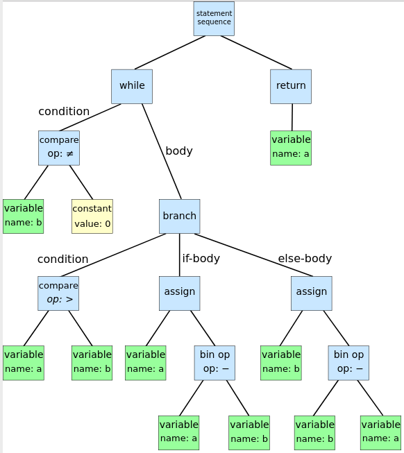
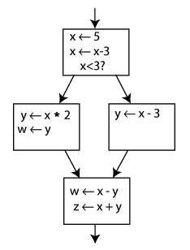
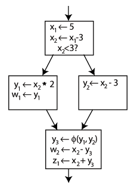
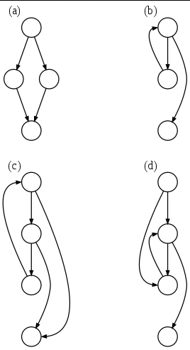
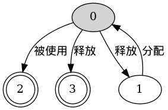

# 5.4 数据流分析

- [基本原理](#基本原理)
- [方法实现](#方法实现)
- [实例分析](#实例分析)


## 基本原理
数据流分析是一种用来获取相关数据沿着程序执行路径流动的信息分析技术。分析对象是程序执行路径上的数据流动或可能的取值。

#### 数据流分析的分类
根据对程序路径的分析精度分类：
- 流不敏感分析（flow insensitive）：不考虑语句的先后顺序，按照程序语句的物理位置从上往下顺序分析每一语句，忽略程序中存在的分支
- 流敏感分析（flow sensitive）：考虑程序语句可能的执行顺序，通常需要利用程序的控制流图（CFG）
- 路径敏感分析（path sensitive）：不仅考虑语句的先后顺序，还对程序执行路径条件加以判断，以确定分析使用的语句序列是否对应着一条可实际运行的程序执行路径

根据分析程序路径的深度分类：
- 过程内分析（intraprocedure analysis）：只针对程序中函数内的代码
- 过程间分析（inter-procedure analysis）：考虑函数之间的数据流，即需要跟踪分析目标数据在函数之间的传递过程
  - 上下文不敏感分析（context-insensitive）：将每个调用或返回看做一个 “goto” 操作，忽略调用位置和函数参数取值等函数调用的相关信息
  - 上下文敏感分析（context-sensitive）：对不同调用位置调用的同一函数加以区分

#### 检测程序漏洞
由于一些程序漏洞的特征恰好可以表现为特定程序变量在特定的程序点上的性质、状态或取值不满足程序安全的规定，因此数据流分析可以直接用于检测这些漏洞。

例如指针变量二次释放的问题：
```c
free(p);
[...]
free(p);
```
使用数据流分析跟踪指针变量的状态，当指针 p 被释放时，记录指针变量 p 的状态为已释放，当再次遇到对 p 的释放操作时，对 p 的状态进行检查。

有时还要考虑变量的别名问题，例如下面这样：
```c
p = q;
free(q);
[...]
*p = 1;
```
这时就需要建立别名关系信息来辅助分析。

再看一个数组越界的问题：
```c
a[i] = 1;
```
使用数据流分析方法一方面记录数组 a 的长度，另一方面分析变量 i 的取值，并进行比较，以判断数据的访问是否越界。

```c
strcpy(x, y);
```
记录下变量 x 被分配空间的大小和变量 y 的长度，如果前者小于后者，则判断存在缓冲区溢出。

总的来说，基于数据流的源代码漏洞分析的原理如下图所示：


- 代码建模
  - 该过程通过一系列的程序分析技术获得程序代码模型。首先通过词法分析生成词素的序列，然后通过语法分析将词素组合成抽象语法树。如果需要三地址码，则利用中间代码生成过程解析抽象语法树生成三地址码。如果采用流敏感或路径敏感的方式，则可以通过分析抽象语法树得到程序的控制流图。构造控制流图的过程是过程内的控制流分析过程。控制流还包含分析各个过程之间的调用关系的部分。通过分析过程之间的调用关系，还可以构造程序的调用图。另外，该过程还需要一些辅助支持技术，例如变量的别名分析，Java 反射机制分析，C/C++ 的函数指针或虚函数调用分析等。
- 程序代码模型
  - 漏洞分析系统通常使用树型结构的抽象语法树或者线性的三地址码来描述程序代码的语义。控制流图描述了过程内程序的控制流路径，较为精确的数据流分析通常利用控制流图分析程序执行路径上的某些行为。调用图描述了过程之间的调用关系，是过程间分析需要用到的程序结构。
- 漏洞分析规则
  - 漏洞分析规则是检测程序漏洞的依据。对于分析变量状态的规则，可以使用状态自动机来描述。对于需要分析变量取值的情况，则需要指出应该怎样记录变量的取值，以及在怎样的情况下对变量的取值进行何种的检测。
- 静态漏洞分析
  - 数据流分析可以看做一个根据检测规则在程序的可执行路径上跟踪变量的状态或者变量取值的过程。在该过程中，如果待分析的程序语句是函数调用语句，则需要利用调用图进行过程间的分析，以分析被调用函数的内部代码。另外，数据流分析还可以作为辅助技术，用于完善程序调用图和分析变量别名等。
- 处理分析结果
  - 对检测出的漏洞进行危害程度分类等。


## 方法实现
#### 程序代码模型
数据流分析使用的程序代码模型主要包括程序代码的中间表示以及一些关键的数据结构，利用程序代码的中间表示可以对程序语句的指令语义进行分析。

**抽象语法树（AST）**是程序抽象语法结构的树状表现形式，其每个内部节点代表一个运算符，该节点的子节点代表这个运算符的运算分量。通过描述控制转移语句的语法结构，抽象语法树在一定程度上也描述了程序的过程内代码的控制流结构。

举个例子，辗转相除法的算法描述和抽象语法树如下：
```
while b ≠ 0
if a > b
a := a − b
else
b := b − a
return a
```



**三地址码（TAC）**由一组类似于汇编语言的指令组成，每个指令具有不多于三个的运算分量。每个运算分量都像是一个寄存器。

通常的三地址码指令包括下面几种：
- `x = y op z`：表示 y 和 z 经过 op 指示的计算将结果存入 x
- `x = op y`：表示运算分量 y 经过操作 op 的计算将结果存入 x
- `x = y`：表示赋值操作
- `goto L`：表示无条件跳转
- `if x goto L`：表示条件跳转
- `x = y[i]`：表示数组赋值操作
- `x = &y`、`x = *y`：表示对地址的操作
- ```
  param x1
  param x2
  call p
  ```
  表示过程调用 p(x1, x2)

举个例子：
```
for (i = 0; i < 10; ++i) {
    b[i] = i*i; 
}
```
```
     t1 := 0                ; initialize i
L1:  if t1 >= 10 goto L2    ; conditional jump
     t2 := t1 * t1          ; square of i
     t3 := t1 * 4           ; word-align address
     t4 := b + t3           ; address to store i*i
     *t4 := t2              ; store through pointer
     t1 := t1 + 1           ; increase i
     goto L1                ; repeat loop
L2:
```

**静态单赋值形式（SSA）**是一种程序语句或者指令的表示形式，在这种表示形式中，所有的赋值都是针对具有不同名字的变量，也就是说，如果某个变量在不同的程序点被赋值，那么在这些程序点上，该变量在静态单赋值形式的表示中应该使用不同的名字。在使用下标的赋值表示中，变量的名字用于区分程序中的不同的变量，下标用于区分不同程序点上变量的赋值情况。另外，如果在一个程序中，同一个变量可能在两个不同的控制流路径中被赋值，并且在路径交汇后，该变量被使用，那么就需要一种被称为 Φ 函数的的表示规则将变量的赋值合并起来。

看下面这个例子：




通过 Φ 函数在最后一个区块的起始产生一个新的定义 y3，这样程序就会根据具体的运行路径来选择是 y1 还是 y2，而在最后一个区块中，仅需要使用 y3，即可得到正确的数值。

静态单赋值形式对于数据流分析的意义在于，可以简单而直接地发现变量的赋值和使用情况，以此分析数据的流向并发现程序不安全的行为。

**控制流图（CFG）**通常是指用于描述程序过程内的控制流的有向图。控制流由节点和有向边组成。典型的节点是基本块（BB），即程序语句的线性序列。有向边表示节点之间存在潜在的控制流路径，通常都带有属性（如if语句的true分支和false分支）。

看几个例子：



- (a)：一个 if-then-else 语句
- (b)：一个 while 循环
- (c)：有两个出口的自然环路（natural loop），例如一个有 if 语句的 while 循环，非结构化但可以简化
- (d)：有两个入口的循环，例如 goto 到一个 while 或者 for 循环里，不可简化

**调用图（CG）**是描述程序中过程之间的调用和被调用关系的有向图。控制图是一个节点和边的集合，并满足如下原则：
- 对程序中的每个过程都有一个节点
- 对每个调用点都有一个节点
- 如果调用点 c 调用了过程 p，就存在一条从 c 的节点到 p 的节点的边

#### 程序建模
程序建模包括代码解析和辅助分析两个部分。其中代码解析过程是指词法分析、语法分析、中间代码生成以及过程内的控制流分析等基础的分析过程。辅助分析主要包括控制流分析等为数据流分析提供支持的分析过程。

在代码解析过程中，词法分析读入源程序输出词素序列，每个词素对应一个词法单元，语法分析使用词法单元的第一个分量来创建抽象语法树，中间代码生成过程将抽象语法树转化为三地址码，而三地址码常表示为静态单赋值形式。编译器在源代码编译过程中得到的中间表示及其他的数据结构可以很好地为检测程序漏洞的数据流分析所用。因此，一些分析系统将相应的代码编译器实现的某些过程或者代码解析组件作为分析系统的前端，利用这些过程或者组件获得所需的数据结构，完成堆程序源代码的解析。然而，对于解释型语言或者脚本语言编写的程序，程序代码直接被解释器解释执行，没有相应的编译器实现对程序代码的基本解析。这时，我们需要在分析系统中设计完成代码解析的各个部分。而对于某些语言如 Java，其编译后得到的中间程序被相应的虚拟机执行。这时，分析系统可以分析这个中间程序，即 .class 文件。

在辅助分析过程中，通过过程内的程序流分析可以构建过程的控制流图。如果分析系统选择使用抽象语法树作为中间表示，可以尝试在抽象语法树中增加控制流的边。如果选择三地址码作为中间表示，则需要分析其中的控制转移语句构建控制流图，具体过程如下：首先逐句分析程序指令或者指令，识别其中的控制转移语句，将一段代码划分为一个个基本块，然后根据控制转移语句指明的跳转到的代码的位置，将基本块连接起来。

对于调用图的构建，如果是直接过程调用的程序，每个调用的目标都可以静态确定，则调用图中的每个调用点恰好有一条边指向一个调用过程。但如果程序使用了过程参数或者函数指针，则通过静态分析只能得到近似的估计。对于面向对象程序设计语言来说，间接调用才是常用的方式。此时需要分析调用点调用所接收对象的类型来确定调用的是哪个方法。

#### 漏洞分析规则
程序漏洞通常和程序中变量的状态或者变量的取值相关。状态自动机可以描述和程序变量状态相关的漏洞分析规则，自动机的状态和变量相应的状态对应。和变量取值相关的检测规则通常包含和程序语句或者指令相关的对变量取值的记录规则以及在特定情况下变量取值需要满足的约束。

一个描述指针变量使用的有限状态自动机的例子：



一个用于检测缓冲区溢出漏洞的分析变量取值的规则如下：
```c
char a[10];     // len(a) = 10;
[...]
strcpy(dest, src);    // len(dest) > len(src);
```

#### 静态漏洞分析
数据流分析检测漏洞是利用分析规则按照一定的顺序分析代码中间表示的过程。

**过程内分析**。对于抽象语法树的分析，可以按照程序执行语句的过程从右向左、自底向上地进行分析。对于三地址码的分析，则可以直接识别其操作以及操作相关的变量。

通常，赋值语句、控制转移语句和过程调用语句是数据流分析最关心的三类语句。通过赋值语句，程序变量的状态或者取值常常会改变，在分析过程中，可以根据分析规则将所关心的变量的状态或取值记录下来。在分析的同时还需要考虑到控制转移语句中的路径条件。对过程调用语句的分析需要根据函数或方法的名字识别其语义或者根据调用图进行过程间的分析。通过将代码语义和漏洞分析规则联系起来，就能确定在分析中需要记录怎样的信息。

过程内分析的另一个关键是确定分析语句的顺序，即利用程序语句的存储位置或者根据控制流图依次确定待分析的每一条程序语句。在流不敏感分析中，常常使用线性扫描的方式依次分析每一条中间表示形式的语句；流敏感的分析或路径敏感的分析，则根据控制流图进行分析。对控制流图的遍历主要是深度优先和广度优先两种方式。在遍历并分析程序的过程中，需要在基本块上保存一定的部分分析结果，以为之后的分析所用。基本块的摘要通常包括前置条件和后置条件两部分，前置条件记录对基本块分析前已有的相关分析结果；后置条件是分析基本块后得到的结果。在分析基本块之前，首先使用该节点的前向节点的后置条件，计算该基本块的前置条件，如果该基本块已经被分析过，则将已有的前置条件和计算得到的前置条件相比较，如果相同，则不需要再对该块进行分析。

**过程间分析**。一个简单的思路是：如果在分析某段程序中遇到过程调用语句，就分析其调用过程的内部的代码，完成分析之后再回到原来的程序段继续分析。另一种思路是借鉴基本块的分析，给过程设置上摘要，也包含前置条件和后置条件。

#### 指向分析
指向分析（points-to analysis）用于回答变量指向哪些被分配空间的对象这样的问题。通过对待分析的程序使用指向分析，可以大致确定变量指向哪些对象，进而构建相对准确的调用图。指向分析常常需要虚拟一个存储空间，用于记录被分配空间的对象。

例如下面这段 Java 代码：
```
obj = new Type();   // 在虚拟存储空间记录一个对象 o，同时记录变量 obj 指向对象 o
obj1 = obj2;        // 如果 obj2 指向对象 o2，则记录 obj1 指向对象 o2
obj1.field = obj2;  // 记录 obj1 的实例域 field 指向 obj2 指向的对象
obj2 = obj1.field;  // 记录 obj2 指向对象 obj1 的实例域 field
```

对于 C 语言的指向分析就相对复杂一些，因为 C 语言可以使用指针变量。指针变量存储的是某个对象在存储空间中的地址，所以在指向分析中，通常还要加入地址这样的信息，主要有下面四种形式的赋值语句：
```
p = q;
p = &q;
p = *q;
*p = q;
```

通过指向分析，可以得到变量指向的被分配空间的对象集合。根据集合中对象的类型以及程序中类的层次结构，可以大致确定某个调用点调用的方法是哪些类中声明的方法。指向分析的结果中如果两个变量指向的对象的集合是相同的，则可以确定它们互为别名。


## 实例分析
