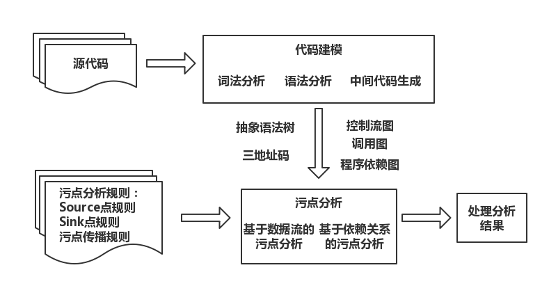

# 5.5 污点分析

- [基本原理](#基本原理)
- [方法实现](#方法实现)
- [实例分析](#实例分析)


## 基本原理
污点分析是一种跟踪并分析污点信息在程序中流动的技术。在漏洞分析中，使用污点分析技术将所感兴趣的数据（通常来自程序的外部输入）标记为污点数据，然后通过跟踪和污点数据相关的信息的流向，可以知道它们是否会影响某些关键的程序操作，进而挖掘程序漏洞。即将程序是否存在某种漏洞的问题转化为污点信息是否会被 Sink 点上的操作所使用的问题。

污点分析常常包括以下几个部分：
- 识别污点信息在程序中的产生点（Source点）并对污点信息进行标记
- 利用特定的规则跟踪分析污点信息在程序中的传播过程
- 在一些关键的程序点（Sink点）检测关键的操作是否会受到污点信息的影响

举个例子：
```
[...]
scanf("%d", &x);    // Source 点，输入数据被标记为污点信息，并且认为变量 x 是污染的
[...]
y = x + k;          // 如果二元操作的操作数是污染的，那么操作结果也是污染的，所以变量 y 也是污染的
[...]
x = 0;              // 如果一个被污染的变量被赋值为一个常数，那么认为它是未污染的，所以 x 转变成未污染的
[...]
while (i < y)       // Sink 点，如果规定循环的次数不能受程序输入的影响，那么需要检查 y 是否被污染
```

然而污点信息不仅可以通过数据依赖传播，还可以通过控制依赖传播。我们将通过数据依赖传播的信息流称为显式信息流，将通过控制依赖传播的信息流称为隐式信息流。

举个例子：
```c
if (x > 0)
    y = 1;
else
    y = 0;
```
变量 y 的取值依赖于变量 x 的取值，如果变量 x 是污染的，那么变量 y 也应该是污染的。

通常我们将使用污点分析可以检测的程序漏洞称为污点类型的漏洞，例如 SQL 注入漏洞：
```java
String user = getUser();
String pass = getPass();
String sqlQuery = "select * from login where user='" + user + "' and pass='" + pass + "'";
Statement stam = con.createStatement();
ResultSetrs = stam.executeQuery(sqlQuery);
if (rs.next())
    success = true;
```
在进行污点分析时，将变量 user 和 pass 标记为污染的，由于变量 sqlQuery 的值受到 user 和 pass 的影响，所以将 sqlQuery 也标记为污染的。程序将变量 sqlQuery 作为参数构造 SQL 操作语句，于是可以判定程序存在 SQL 注入漏洞。

使用污点分析检测程序漏洞的工作原理如下图所示：



- 基于数据流的污点分析。在不考虑隐式信息流的情况下，可以将污点分析看做针对污点数据的数据流分析。根据污点传播规则跟踪污点信息或者标记路径上的变量污染情况，进而检查污点信息是否影响敏感操作。
- 基于依赖关系的污点分析。考虑隐式信息流，在分析过程中，根据程序中的语句或者指令之间的依赖关系，检查 Sink 点处敏感操作是否依赖于 Source 点处接收污点信息的操作。


## 方法实现
#### 基于数据流的污点分析

#### 基于依赖关系的污点分析


## 实例分析
