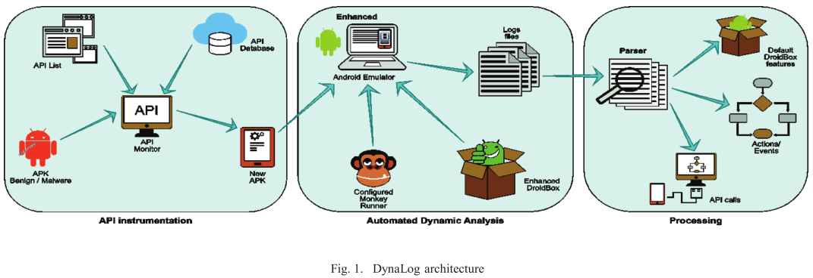
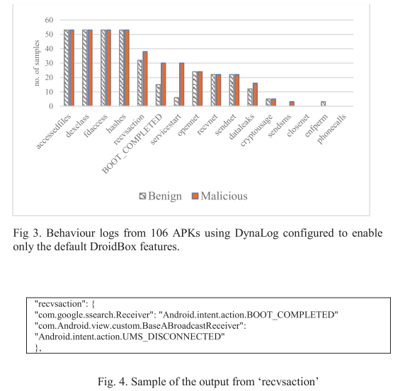
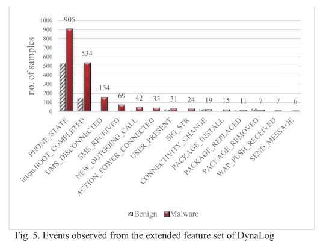
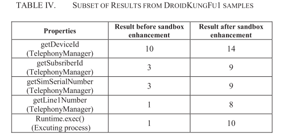
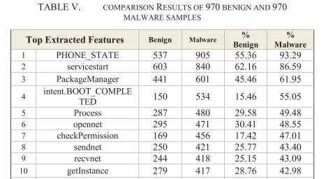

# 8.16 DynaLog: An automated dynamic analysis framework for characterizing Android applications

[paper](https://pure.qub.ac.uk/portal/files/93998809/DynaLog_2016.pdf)

## What is your take-away message from this paper?
The authors presented DynaLog, a framework that enable automated mass dynamic analysis of applications in order to characterize them for analysis and potential detection of malicious behaviour.

## What are motivations for this work?
#### Malware
- more then 5 million malware samples
- signature-based AVs take up to 48day to detect new malware
- sophisticated detection avoidance techniques such as obfuscation, and payload encryption making it more difficult

#### Current Methods' Limitations
- Static: detection avoidance by sophisticated obfuscation techniques, run-time loading of malicious payload.
- Dynamic: are either closed source or can only be accessed by submitting apps online for analysis, which can also limit automated mass analysis of apps by analysts.

## What is the proposed solution?
DynaLog has several components:
1. Emulator-based analysis sandbox
2. APK instrumentation module
3. behaviour/features logging and extraction
4. Application trigger/exerciser
5. Log parsing and processing scripts

#### Dynamic analysis tool (DroidBox capabilities)
- An open source tool used to extract some high level behaviour and characteristics by running the app on an Android device emulator or (AVD).
- Extracts these behaviours from the logs dumped by logcat.
- Uses Androguard to extract static meta-data relating to the app.
- Utilizes Taintdroid for data leakage detection.
- Used as a building block for several dynamic analysis tools.

#### Problems with Sandbox performance
- Lack of complete code coverage.
- Lack of complete traffic communication, server not found.
- Real events need to trigger some malicious behaviour.

#### Extended Sandbox to overcome these issues by:
- Improving AVD emulator to behave like realistic devece
- New scripts to improve code coverage

## What is the work's evaluation of the proposed solution?
#### Dataset
>We used 1226 real malware samples from 49 families of the Malgenome Project malware dataset. Furthermore, a set of 1000 internally vetted benign APKs from McAfee Labs were utilized.

#### Experiment 1: evaluating high level behaviour features

#### Experiment 2: evaluating extended features and sandbox enhancements within DynaLog

#### Results

## What is your analysis of the identified problem, idea and evaluation?
- DynaLog suffers from the same limitations  of other dynamic analysis tools.
- Sophisticated Android malware employ detection avoidance techniques in order to hide their malicious activities from analysis tools.
- DynaLog does not log output from native code.

## What are the contributions?
- We present DynaLog, a dynamic analysis framework to enable automated analysis of Android applications.
- We present extensive experimental evaluation of DynaLog using real malware samples and clean applications in order to validate the framework and measure its capability to enable identification of malicious behaviour through the extracted behavioural features.

## What are future directions for this research?
For future work we intend to develop and couple classification engines that can utilize the extensive features of DynaLog for accurate identification of malware samples. Furthermore, we intend to enhance the framework to improve its robustness against anti-analysis techniques employed by some malware whilst also incorporating new feature sets to improve the overall analysis and detection capabilities.

## What questions are you left with?
