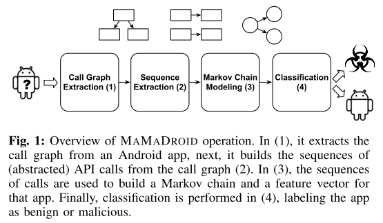
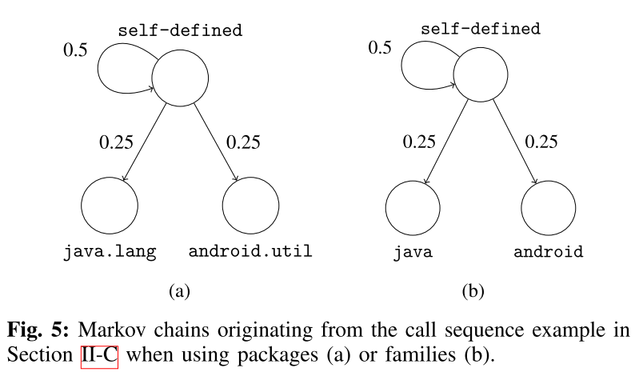
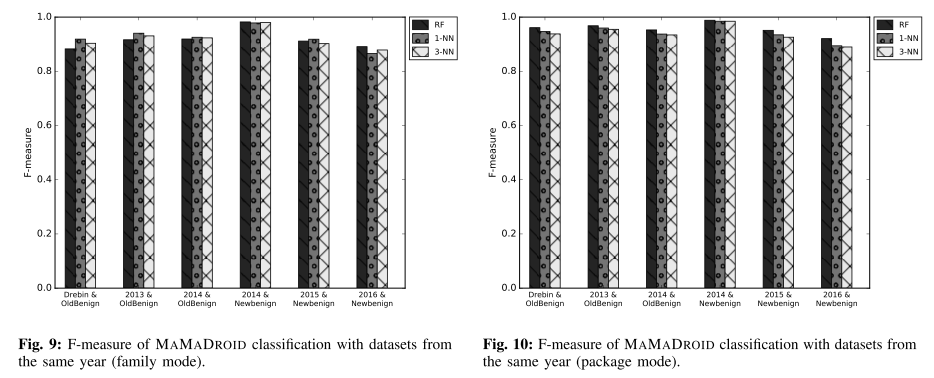
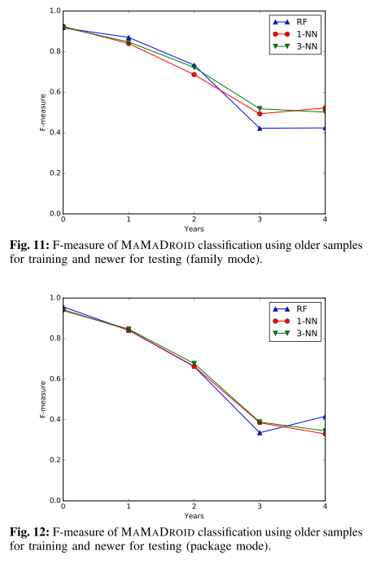

# 8.18 MaMaDroid: Detecting Android malware by building Markov chains of behavioral models

[paper](http://discovery.ucl.ac.uk/1532047/1/Stringhini_mamadroid.pdf)

## What is your take-away message from this paper?
This paper presented an Android malware detection system based on modeling the sequences of API calls as Markov chains.

## What are motivations for this work?
#### Android & Malware
Now making up 85% of mobile devices, Android smartphones have become profitable targets for cybercriminals, allowing them to bypass two factor authentication or steal sensitive information.

#### Current Defenses
- Smartphones have limited battery, making it infeasible to use traditional approaches.
- Google Play Store is not able to detect all malicious apps.
- Previous malware detection studies focused on models based on permissions or on specific API calls. The first is prone to false positives and the latter needs constant retraining.

#### The Idea
While malicious and begign apps may call the same API calls during their execution, but being called in a different order.

## What is the proposed solution?
>We present a novel malware detection system for Android that instead relies on the *sequence* of *abstracted* API calls performed by an app rather than their use or frequency, aiming to capture the behavioral model of the app.

MaMaDroid is build by combining four different phases:
- Call graph extraction: starting from the apk file of an app, we extract the call graph of the analysed sample.
- Sequence extraction: from the call graph, we extract the different potential paths as sequences of API calls and abstract all those calls to higher levels.
- Markov Chain modelling: all the samples got their sequences of abstracted calls, and these sequences can be modelled as transitions among states of a Markov Chain.
- Classification: Given the probabilities of transition between states of the chains as features set, we apply machine learning to detect malicious apps.

#### Call Graph Extraction
Static analysis apk using the [Soot](https://sable.github.io/soot/) framework to extract call graphs and [FlowDroid](https://blogs.uni-paderborn.de/sse/tools/flowdroid/) to ensure contexts and flows are preserved.

#### Sequence Extraction
Taking the call graph as input, it extract the sequences of functions potentially called by the program and, by identifies a set of entry nodes, enumerates the paths and output them as sequences of API calls.

>The set of all paths identified during this phase constitute the sequences of API calls which will be used to build a Markov chain behavioural model and to extract features.

The system operate in one of two modes by abstracting each call to either its package or family.
- in package mode: abstract an API call to its package name using the list of Android packages (includes 243 packages, 95 from the Google API, plus self-defined and obfuscated packages).
- in family mode: abstract to nine possible families (android, google, java, javax, xml, apache, junit, json, dom) or developer-defined (self-defined) and obfuscated (obfuscated) packages.

>This allows the system to be resilient to API changes and achieve scalability. In fact, our experiments, presented in section III, show that, from a dataset of 44K apps, we extract more than 10 million unique API calls, which would result in a very large number of nodes, with the corresponding graphs (and feature vectors) being quite sparse.

#### Markov Chain Modeling
Now it builds a Markov chain where each package/family is a state and the transitions represent the probability of moving from one state to another.

>Next, we use the probabilities of transi-tioning from one state (abstracted call) to another in the Markov chain as the feature vector of each app. States that are not present in a chain are represented as 0 in the feature vector. Also note that the vector derived from the Markov chain depends on the operational mode of MAMADROID. With families, there are 11 possible states, thus 121 possible transitions in each chain, while, when abstracting to packages, there are 340 states and 115,600 possible transitions.

The authors also experiment with applying PCA (Principle Component Analysis) to reduce the feature space.

#### Classification
The phase uses Machine Learning algorithms: Random Forests, 1-NN, 3-NN and SVM. The last one was discarded as it was slower and less accurate in classification than the other ones.

## What is the work's evaluation of the proposed solution?
The authors gathered a collection of 43,490 Android apps, 8,447 benign and 35,493 malware apps. This included a mix of apps from October 2010 to May 2016, enabling the robustness of classification over time to be explored.

 The authors used the F-Measure to evaluate our system through 3 different kinds of tests: testing on samples from the same databases of the training set, testing on newer samples than the ones used for the training set, and testing on older samples than the ones used for the training set.

 

 >As Android evolves over the years, so do the characteristics of both benign and malicious apps. Such evolution must be taken into account when evaluating Android malware detection systems, since their accuracy might significantly be affected as newer APIs are released and/or as malicious developers modify their strategies in order to avoid detection. Evaluating this aspect constitutes one of our research questions, and one of the reasons why our datasets span across multiple years (2010–2016).

 Testing on samples newer than the training ones (figure below, on the left) helps understanding if the system is resilient to changes in time, or if it needs constant retraining.

 

 It also set to verify whether older malware samples can still be detected, with similar F-measure scores across the years ranging from 95-97% in package mode.

## What is your analysis of the identified problem, idea and evaluation?
As both Android malware and the operating system itself constantly evolve, it is very challenging to design robust malware mitigation techniques that can operate for long periods of time without the need for modifications or costly re-training.

The system abstractes to families or packages makes it less susceptible to the introduction of new API calls. It's a great idea and be proved to have good performance.

But the system might be evaded through repackaging benign apps, or make a new app by imitating the Markov chains of benign apps.

## What are the contributions?
>First, we introduce a novel approach, implemented in a tool called MAMADROID, to detect Android malware by abstracting API calls to their package and family, and using Markov chains to model the behavior of the apps through the sequences of API calls. Second, we can detect unknown samples on the same year of training with an F-measure of 99%, but also years after training the system, meaning that MAMADROID does not need continuous re-training. Our system is scalable as we model every single app independently from the others and can easily append app features in a new training set. Finally, compared to previous work [2], MAMADROID achieves significantly higher accuracy with reasonably fast running times, while also being more robust to evolution in malware development and changes in the Android API.

## What are future directions for this research?
In the future the authors plan to work on exploring and testing in deep MaMaDroid’s resilience to the main evasion techniques, to try more fine-grained abstractions and seed with dynamic analysis.

## What questions are you left with?
What are the stable things with Android system updating, whether they can be used for malware detection and, how to keep accuray and stability for a long time?
